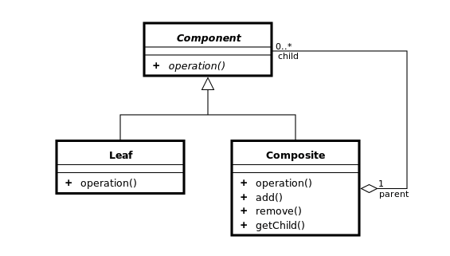
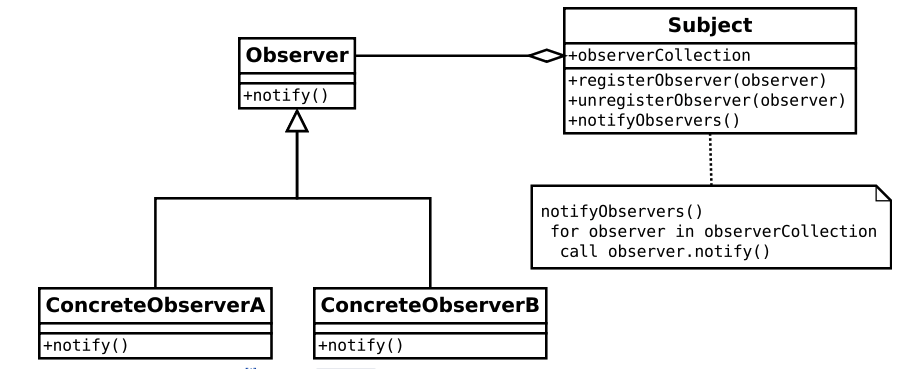
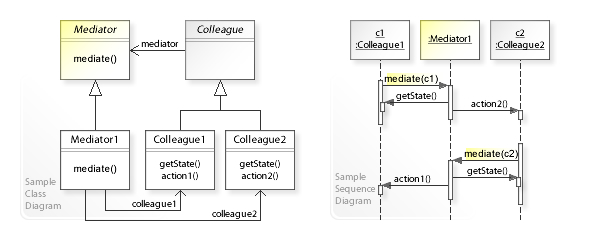
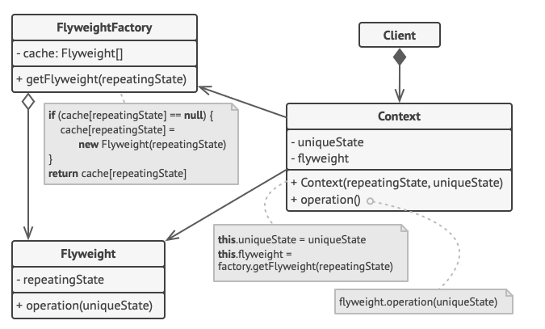

## GOF Design Pattern 분류

- 생성( Creational ) 패턴

  - 추상 팩토리
  - 팩토리 메서드
  - 빌더
  - 프로토타입
  - 싱글턴

- 구조( Structural ) 패턴

  - 어댑터
  - 브릿지
  - 컴퍼지트
  - 데코레이터
  - 플라이웨이트
  - 프록시

- 행위 ( Behavioral ) 패턴

  - 책임 연쇄
  - 커맨드
  - 인터프리터
  - 이터레이터
  - 중재자 패턴
  - 메멘토
  - 옵져버
  - 스테이트
  - 스트래티지
  - 템플릿 메서드
  - 비지터

## Composite Pattern

- 객체들의 관계를 트리 구조로 구성하여 부분-전체 계층을 표현하는 패턴
- 클라이언트가 단일 객체와 복합 객체 모두 동일하게 다루도록 한다.
- 객체들 간에 계급 및 계층 구조가 있고 이를 표현할 때 씀
- 클라이언트가 단일 객체와 집합 객체를 구분하지 않고 동일한 형태로 사용하고자 할 때

- Components는 Leaf, Composite가 구현해야하는 interface임
- Leaf는 단일 객체
- Composite는 집합 객체로 Component를 자식으로 둔다.
- 컴포지트 패턴은 타입의 안정성보다는 일관성을 더 강조한다고 한다.
- 설계를 일반화 시켜 객체간의 구분, 제약이 힘들다. -> 타입 안정성..

## Observer Pattern

- 객체의 상태 변화를 관찰하는 관찰자들, 즉 옵저버들의 목록을 객체에 등록하여 상태 변화가 있을 때 마다 객체가 직접 목록의 옵저버에게 통지하도록 하는 패턴

- 분산 이벤트 핸들링 시스템을 구현할 때 사용, 발행/구독 모델로도 알려져있다.

- 주제와 옵저버가 느슨하게 결합되어 있는 객체 디자인을 제공한다. 객체간 의존성 제고

  - 옵저버를 언제든 새로 추가, 제거 가능
  - 새로운 형식의 옵저버여도 주제를 변경 안해도 됨
  - 서로 독립적으로 재사용 가능,
  - 바뀌어도 서로 영향 x

- 한 객체의 변경사항을 다른 객체에 전파 가능

- 너무 많이 사용하게 되면, 상태 관리가 힘들 수 있습니다

- 순환 실행의 문제가 있을수도 있다.
  

## Mediator Pattern - 중재자

- 객체들 간의 상호작용 행위를 정리하여 따로 모아놓은 중재자(미디에이터) 객체를 따로 두어 관리하는 디자인 패턴
- 다대다 관계의 복잡한 객체간의 관계에 중간 객체를 도입, ,,, 이벤트가 발생하는 객체가 여럿, 받는 객체가 여럿,.일떄
- 객체 간의 직접적인 소통보다 중재자를 통해 소통하게 된다.
- 객체 간의 의존성을 줄여 결합도를 감소시킨다.
- 잘못 사용할 경우 중재자 객체에 모든 권한이 집중되어 크고 복잡해진다.

  

## Flyweight 패턴

- 어떤 클래스의 인스턴스 한 개만 가지고 여러 개의 가상 인스턴스를 제공하고 싶을 떄 사용하는 패턴

- 동일하거나 유사한 객체들 사이에 가능한 많은 데이터를 서로 공유하도록 하여 메모리 사용량을 최소화

- 구조패턴

- 일단 구성되면 수정 불가능

- 예를들어 텍스트 편집기에서 Character클래스, 문자 'B'

- 비용이 큰 자원을 공통으로 사용할 수 있도록 만드는 패턴

  - 중복 생성 될 가능성이 높은 경우
  - 자원 생성 비용은 크지만 사용 빈도는 낮을 경우

  

* **객체의 특성을 내적 속성(Intrinsic Properties)과 외적 속성(Extrinsic Properties)으로 나눴을 때, 객체의 외적 특성이 클라이언트 프로그램으로부터 정의되어야 한다**
* **객체의 내적 속성은 객체를 유니크하게 하는 것이고, 외적 속성은 클라이언트의 코드로부터 설정되어 다른 동작을 수행하도록 사용되는 특성입니다. 예를 들어, Circle 이라는 객체는 color와 width라는 외적 속성을 가질 수 있습니다.**
