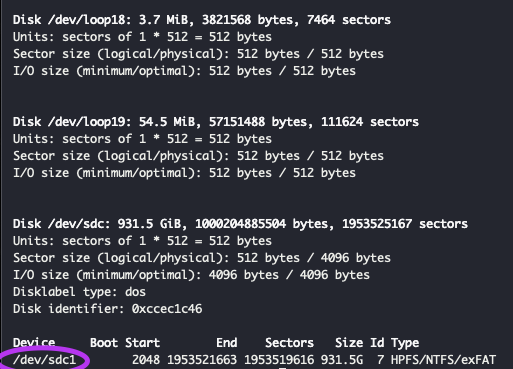

#### 요즘 회사가 바빠 일하느라.. 운동하느라... 
#### 3일차만에 글을 못쓰고 밤이 되어버렸다. 따라서 quiver에 몇년 간 작성해놨던 팁 노트중 짧은걸 하나 옮겨야겠다..
<br/>

나는 따로 남는 노트북을 서버로 사용하고있다.

동영상 스트리밍 서버가 필요했고, 노트북의 용량은 그리 넉넉하지 못하며, 우분투에서 바로 동영상을 받기보단 윈도우에서 옮기는 경우가 더 많기에 

외장하드를 노트북에 연결해서 스트리밍서버의 저장소로 사용하기로 했다.

스트리밍서버는 따로 plex라는 서비스를 사용했는데 이건 나중에 시간이 나면 글을 작성하고 ...

어쩃든 외장하드를 그냥 꽂는 것 만으로는 서버에서 바로 사용할 수 있는건 아니라서 디스크를 마운트 해줬어야 했다.


```shell
sudo fdisk -l 
```
으로 먼저 외장하드가 마운트된 주소를 확인해본다.


아래 표시된 부분의 위치를 기억하고 , 

```shell
sudo mount -t ntfs-3g /dev/sdc1 ~/hdd
```

하면 끝!

`-t ntfs-3g` 은 `--types` 인데 파일시스템 타입 관련한 옵션같다. 보통 mount 커멘드는 filesystem을 감지가 가능하다고 하니 .. 필요없는거같긴하다.

ext2, ext3, ext4, xfs등 여러 옵션이 있다.

또한, 파일시스템에 접근하는 것은 루트퍼미션이 필요하다

자세한건 `man mount` ㄲ


마운트 된걸 언마운트 하는건 더 쉽다.

```shell
sudo umount hdd
```


