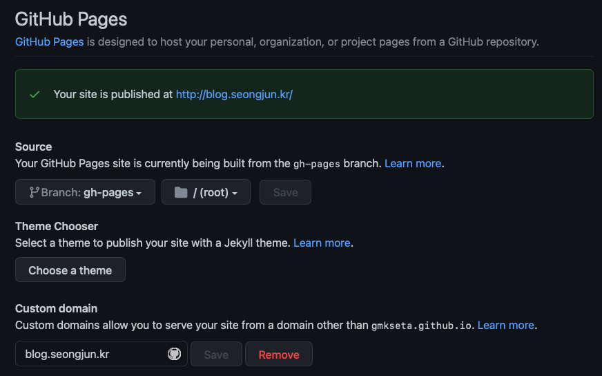
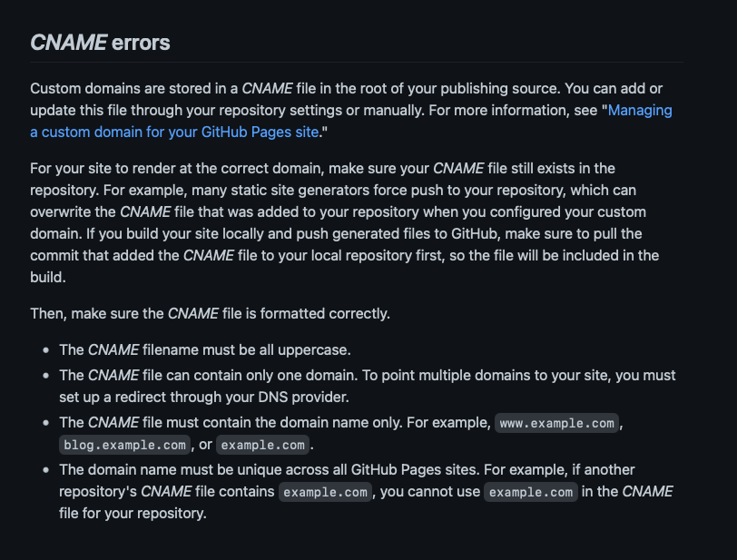
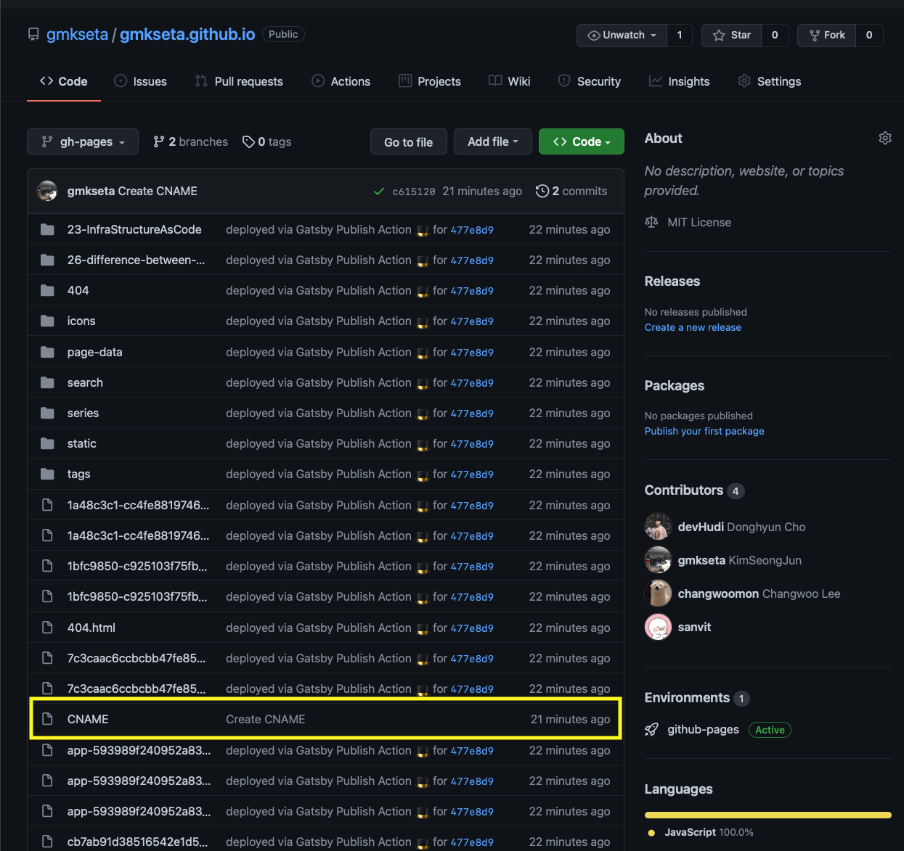
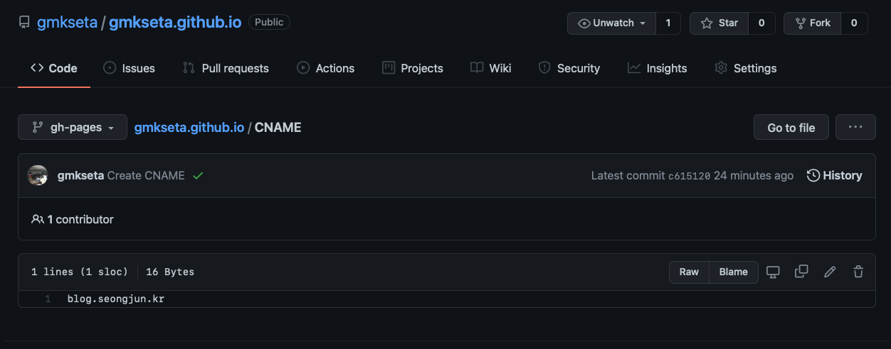

## gatsby-gh-pages-action, custom domain(cname) 적용 안 될 때

새 블로그를 `gatsby-gh-pages-action` 으로 배포하고 있다.

`main` 브랜치에 푸시가 되면 github action으로 빌드를 하고, gh-pages로 푸시를 한다.

gh-pages으로 정적 페이지들이 올라가면 이를 블로그로 사용한다 ( `gmkseta.github.io`)

사용법은 대충 github action 만들고 세팅에서 사진처럼 설정하면 끝인데

```yaml
name: CI

on:
  push:
    branches:
      - main
    paths-ignore:
      - "**/README.md"

jobs:
  deploy:
    runs-on: ubuntu-latest
    steps:
      - uses: actions/checkout@v2
        with:
          token: ${{ secrets.ACCESS_TOKEN }}
          submodules: true

      - uses: enriikke/gatsby-gh-pages-action@v2
        with:
          access-token: ${{ secrets.ACCESS_TOKEN }}
          deploy-branch: gh-pages
          skip-publish: false
```



# 문제

## 배포할 때 마다 Custom Domain 설정이 사라진다...?


# 원인을 찾아보자.

- github docs를 찾아봤더니 다음과 같은 글이 나왔다.



- 대충 읽어보자면 CNAME file에 저장이 된다는데....
- 한번 gh-pages 브랜치를 살펴보자..



* 배포를 위해 빌드된 파일들이 들어가 있고, 잘 보니 CNAME 파일이 있다.



### 설정에서 Custom Domain을 추가하면 CNAME 파일이 생성되어 설정한 Custom Domain이 들어간다.

### 하지만 gh-pages 브랜치는 배포용이어서 늘 강제푸시되는 브랜치이고....

### main 브랜치에서는 CNAME이 없어서 설정은 빠지고, 설정해도 gh-pages브랜치만 반영이 된 것

# 해결

## main branch에 CNAME 파일 하나 추가 - 끗


## References

- https://docs.github.com/en/pages/configuring-a-custom-domain-for-your-github-pages-site/troubleshooting-custom-domains-and-github-pages#https-errors
