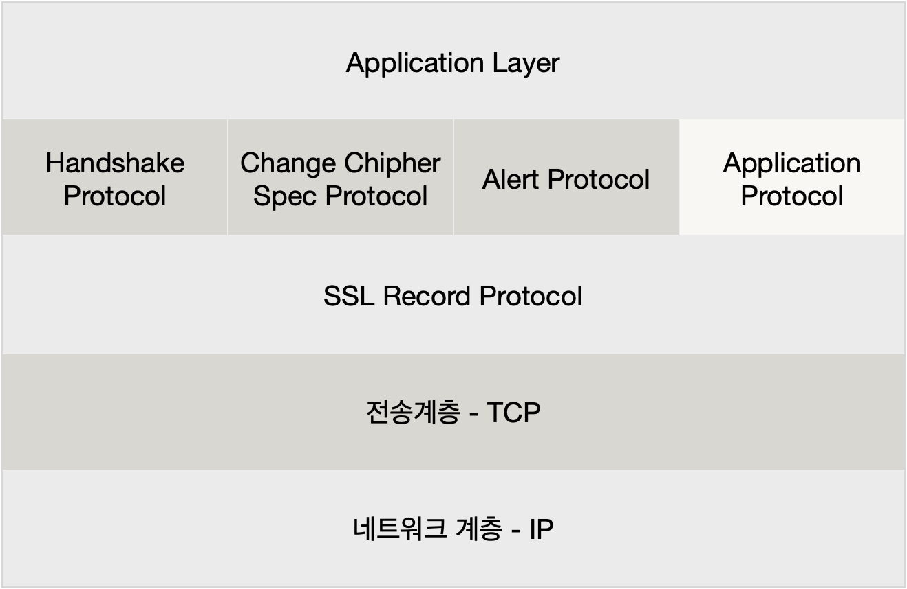

# HTTPS와 SSL

- https에 대해서 certbot 혹은 aws acm으로 SSL 인증서를 적용 시키는 것 외에 제대로 된 개념을 알고있지 못했다.
- 그냥 보안이 좋다더라? 정도밖에..
- 이참에 알아보자

## HTTP - HyperText Transfer Protocol

- 데이터를 주고받을 수 있는 프로토콜 ( 규칙 )
- 클라이언트와 서버 사이에 이루어지는 요청와 응답 프로토콜
- 주로 TCP를 이용한다.
  - ~~HTTP/3 부터는 UDP를 쓴다는데 왜 그런걸까? 글 거리 하나 추가...~~
- 비연결성 프로토콜이다.
- HTTP에서는 전송되는 정보가 암호화되지 않는다.
- 서버와 클라이언트가 서로 주고받는 메시지를 감청당하기 쉬움
- 기본 포트 80

## HTTPS - HTTP + Secure

- HTTP에서 보안이 강화된 버전
- HTTPS에서는 SSL 을 사용한다.
- 클라이언트와 서버간의 메시지를 암호화 한다!
- 기본 포트 443

## SSL과 TLS

- SSL - Secure Sockets Layer / TSL - Transport Layer Security
- TSL의 과거명칭이 SSL이며 같은 말임 근데 SSL이 더 많이 쓰인다.
- 데이터를 안전하게 전송하기 위한 암호화 통신 프로토콜

암호화를 해서 안전하게 만든다는 것은 알겠다. 하지만 어떻게 암호화를 해서 안전하게 만든다는 것일까?

### SSL 인증서

- 클라이언트와 서버간의 통신을 제 3자가 보증해주는 디지털 인증서
  - 제 3의 신뢰기관이 인증한 인증서
- SSL 기반 하에 클라이언트와 서버 간 암호화 통신을 가능하게 한다.
- 클라이언트가 서버에 접속하면 서버는 클라이언트에게 이 인증서 정보( 공개키 )를 전달한다.
- 클라이언트는 이 인증서가 신뢰할 수 있는 것인지를 검증한다.

### SSL에서 사용하는 암호화

#### 1. 대칭키 방식

* 동일한 키로 암호화와 복호화를 같이 할 수 있는 방식
* 발신자와 수신자가 모두 공유키를 갖고있어야 한다.
* 공유키가 노출되면 위험하다.

#### 2. 공개키 암호화 방식

- 개인 키 ( Private key, 비공개 키 ), 공개 키 ( Public key )를 이용한다.
- 공개키로 암호화 하고 비공개키로 복호화 할 수 있다.
- 공개키는 노출이 되어도 상관 없다.
- 하지만 계산하는데 복잡하고 자원사용도가 높다.

#### 3. 공개키와 대칭키를 혼합해서 사용하는 SSL

* 공개키 암호화 방식은 리소스를 많이 잡아먹는다고 했다. 
* 따라서 실제로 SSL에서는 대칭키와 공개키를 혼합하여 사용
* 클라이언트와 서버가 주고받는 정보는 **대칭키** 방식으로 암호화
* 위에서 **사용할 대칭키**는 **공개키 방식**으로 암호화해서 주고 받음

#### 3. SSL HandShake

* 

### SSL ( Secure Socket Layer ) 동작 원리

#### SSL Protocol Stack

1. SSL Record Protocol
   * 기밀성 ( Confidentiality )과 무결성( Message Integrity )을 제공한다
   * 데이터는 보내기 좋게 나누고, 그 조각들을 압축한다.
   * 그 후 SHA 및 MD5 같은 알고리즘에 의해 생성된 MAC이 추가된다.
   * 데이터를 암호화한 후 마지막으로 SSL 헤더가 데이터에 추가된다.
   * 이후 TCP로 전달

## References

- https://www.geeksforgeeks.org/secure-socket-layer-ssl/
- https://opentutorials.org/course/228/4894
