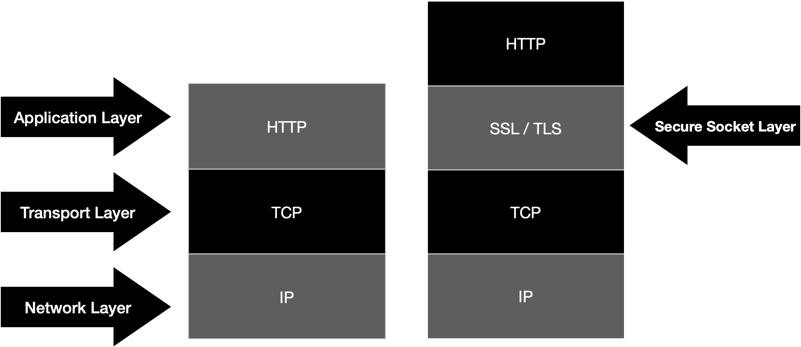

- https에 대해서 certbot 혹은 aws acm으로 SSL 인증서를 적용 시키는 것 외에 제대로 된 개념을 알고있지 못했다.
- 그냥 보안이 좋다더라? 정도밖에..
- 이참에 알아보자

# HTTP - HyperText Transfer Protocol

- 데이터를 주고받을 수 있는 프로토콜 ( 규칙 )
- 클라이언트와 서버 사이에 이루어지는 요청와 응답 프로토콜
- 주로 TCP를 이용한다.
  - ~~HTTP/3 부터는 UDP를 쓴다는데 왜 그런걸까? 글 거리 하나 추가...~~
- 비연결성 프로토콜이다.
- HTTP에서는 전송되는 정보가 암호화되지 않는다.
- 서버와 클라이언트가 서로 주고받는 메시지를 감청당하기 쉬움
- 기본 포트 80

# HTTPS - HTTP + Secure

- HTTP에서 보안이 강화된 버전
- HTTPS에서는 SSL( Secure Sockets Layer ) 을 사용한다.
- 클라이언트와 서버간의 메시지를 암호화 한다!
- 기본 포트 443

* 그림과 같이 Application Layer와 Transport Layer 사이에 위치
* Application Layer에서 받은 데이터를 암호화하여 TCP로 전달
* TCP에서 받은 데이터는 복호화하여 Application에 전달한다
* TCP에서는 SSL을 Application처럼, Application에선  SSL을 TCP처럼 인식한다.
  * 기존 전달 방식 그대로 사용하게 됨

보안 계층을 하나 둬서 암/복호화를 하여 안전하게 메시지를 전달한다.

# SSL과 TLS

- SSL - Secure Sockets Layer / TSL - Transport Layer Security
- TSL의 과거명칭이 SSL이며 같은 말임 근데 SSL이 더 많이 쓰인다.
- 데이터를 안전하게 전송하기 위한 암호화 통신 프로토콜

암호화를 해서 안전하게 만든다는 것은 알겠다. 하지만 어떻게 암호화를 해서 안전하게 만든다는 것일까?

## SSL에서 사용하는 암호화

### 1. 대칭키 방식

- 동일한 키로 암호화와 복호화를 같이 할 수 있는 방식
- 발신자와 수신자가 모두 공유키를 갖고있어야 한다.
- 공유키가 노출되면 위험하다.
- 적은 컴퓨터 자원을 사용, 효율적

### 2. 공개키 암호화 방식

- 개인 키 ( Private key, 비공개 키 ), 공개 키 ( Public key )를 이용한다.
- 공개키로 암호화 하고 비공개키로 복호화 할 수 있다.
- 공개키는 노출이 되어도 상관 없다.
- 계산하는데 복잡하고 자원사용도가 높다.

### 3. 공개키와 대칭키를 혼합해서 사용하는 SSL

- 공개키 암호화 방식은 리소스를 많이 잡아먹는다고 했다.
- 따라서 실제로 SSL에서는 대칭키와 공개키를 **혼합**하여 사용
- 클라이언트와 서버가 주고받는 정보는 **대칭키** 방식으로 암호화
- 위에서 **사용할 대칭키**는 **공개키 방식**으로 암호화해서 주고 받음

### 4. 공개키 암호화 방식의 문제 - CA 그리고 SSL 인증서

- 공개키가 진짜인지 가짜인지 증명할 수가 없다.
- 도중에 해커가 공개키를 바꿔치기 했을 수도 있다.
- 따라서 인증 기관 ( Certificate Authority - CA )이 발급한 공개키 증명서를 사용한다.
  1. 인증 기관에 서버의 공개키를 제출한다
  2. 인증 기관에서는 제출된 공개키에 인증기관의 비밀키로 디지털 서명을 하여 공개키 인증서를 만든다.
  3. 서버는 이 공개키 인증서를 클라이언트에 보낸다.
  4. 클라이언트는 인증기관의 공개키를 사용하여 인증서를 복호화 한다.
- 각 인증기관의 리스트와 공개키들은 클라이언트의 브라우저에 이미 저장되어있다.
- 따라서 클라이언트는 서버에서 보내준 공개키의 신뢰성을 보장할 수 있다.

# opinion

* HTTPS는 HTTP과 달리 보안계층을 하나 둬서 보안이 더 좋다.
* 보안 계층(SSL)은 TCP와 HTTP (application) 사이에 위치한다.
* SSL은 공개키와 대칭키를 혼합해서 사용한다.
* 신뢰 가능한 공개키를 사용하기 위해서 CA에서 발급해준 인증서를 사용한다.
* 생각보다 길어졌다 글을 좀 나누도록 하겠다.

++ 사실 보안 계층이 OSI 7 계층에서 어디에 위치한걸까 고민했다. 

[조금 구글링을 해봤는데](https://learningnetwork.cisco.com/s/question/0D53i00000Kt0q0/which-layer-of-the-osi-model-do-ssl-and-tls-belong-to)  OSI 7계층이 명확하게 일치하는 모델은 아니라는 의견도 있었고

[Session Layer](https://security.stackexchange.com/questions/25568/how-valid-is-this-statement-ssl-sit-between-application-layer-and-network-layer)라는 의견, [Presentation Layer](https://www.techtarget.com/searchnetworking/definition/OSI) Transport Layer 라는 의견 등 다양했다.

명확히 어느 한 계층에 속해서 동작하는 것이 아닌 Application Layer와 Transport Layer 사이의 독립적인 계층을 만들어서 동작하는 것 이라고 이해하고 넘어갔다

# References

- https://www.geeksforgeeks.org/secure-socket-layer-ssl/
- https://opentutorials.org/course/228/4894
- https://learningnetwork.cisco.com/s/question/0D53i00000Kt0q0/which-layer-of-the-osi-model-do-ssl-and-tls-belong-to
