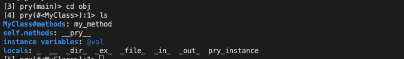
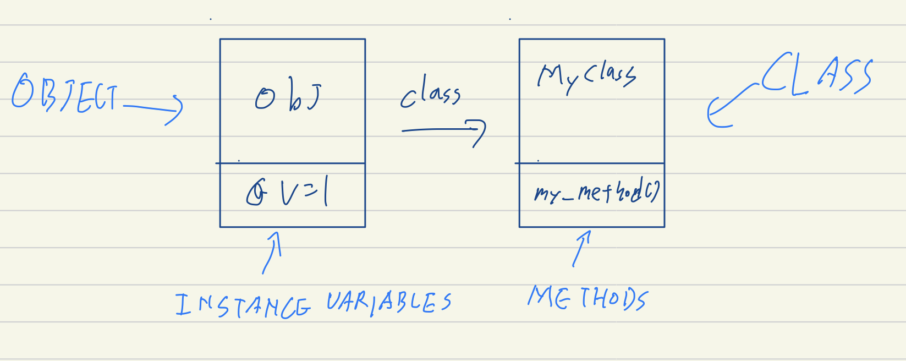
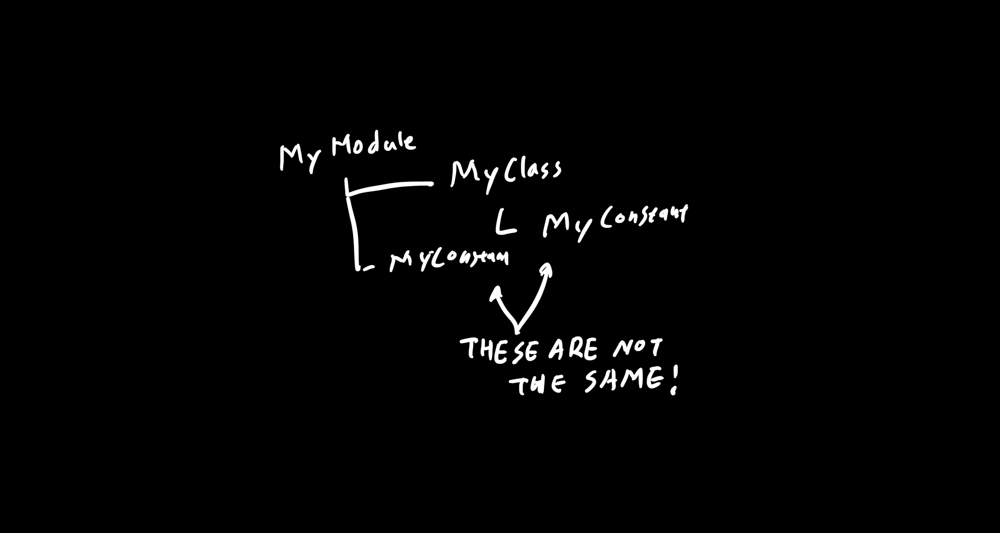

이제 시작이지만 재밌다.

# The Object Model

- 클래스, 모듈, 인스턴스 변수 등과 같은 언어의 구성 요소들은 Object Model이라는 시스템 모델에서 살아간다.
- Object Model에서 우린 "이 메서드는 어떤 클래스의 것 인가요?" 혹은 "이 모듈을 포함하면 어떻게 되나요?" 같은 답을 찾을 수 있다.
- 루비의 **핵심**인 Object Model !

## 오픈 클래스 - Open Classes

- 특수문자 및 숫자를 제거하는 메서드와 그의 테스트 코드를 생각해 보자.
- `test/unit` 은 `gem install test-unit` 이나 `bundle add test-unit`

```ruby
require 'test/unit'

def to_alphanumeric(s)
  s.gsub(/[^\w\s]/, '')
end

class ToAlphanumericTest < Test::Unit::TestCase
  def test_strip_non_alphanumeric
    assert_equal 'qwer asdf 1234', to_alphanumeric('qwer !@#a.sdf 1@@23#4')
  end
end
```

- `to_alphanumeric` 은 객체 지향적이지 않다.
- 외부 메서드를 사용하는 것 보다 문자열이 직접 바꿀 수 있다면 더 좋을 것이다.
- 하지만 그냥 일반적인 문자열인데... 메서드를 추가하려면 `AlphanumericString` 이런식의 클래스를 새로 작성???

**간단한 해결책**

```ruby
require 'test/unit'

class String
  def to_alphanumeric
    gsub(/[^\w\s]/, '')
  end
end

class StringExtensionsTest < Test::Unit::TestCase
  def test_strip_non_alphanumeric
    assert_equal 'qwer asdf 1234', 'qwer !@#a.sdf 1@@23#4'.to_alphanumeric
  end
end
```

### Inside Class Definitions

- 루비에서는 클래스를 정의하는 코드와 다른 종류의 코드가 차이가 없다.
- 클래스 정의에 아무 코드나 넣을 수 있다.

```ruby
# hello.rb
3.times do
    class Hello
      puts "Hello"
    end
end
```

```sh
ruby hello.rb
Hello
Hello
Hello
```

- 다른 코드처럼 클래스 내에서 코드가 실행 되었다!
- 그럼 위의 코드는 같은 이름으로 서로 다른 세 개의 클래스를 정의한 것일까?

```ruby
class Hello
  def a
    'a'
  end
end
class Hello
  def b; 'b'; end
end

hello = Hello.new
hello.a # => "a"
hello.b # => "b"
```

- 처음 `Hello` 를 정의할 때는 `Hello` 라는 이름의 클래스가 존재하지 않는다.
- 따라서 루비는 클래스와 메서드 `a` 를 정의한다.
- 두 번째 에서는 클래스 `Hello` 는 이미 존재하기 때문에 정의할 필요가 없다.
- 기존 클래스를 열고 y라는 메서드를 정의한다.

루비의 클래스 키워드는 클래스를 선언하는 것 보다는 스코프 연산자에 가깝다.

메서드를 정의할 수 있는 곳이 클래스의 컨텍스트에서 사용자로 이동

기존 클래스를 언제든지 다시 열고 표준 라이브러리 클래스도 즉시 수정할 수 있다.

이를 **오픈 클래스**라고 부른다.

다른 예시를 한번 보자!

#### The Money Example

- 통화 관련 유틸리티 라이브러리인 [**Monetize**](https://github.com/RubyMoney/monetize) Gem에서 오픈 클래스의 예를 찾을 수 있다.
- `bundle add monetize`

```ruby
require "monetize"
#I18n.config.available_locales = :en

price = Monetize.from_numeric(100, "USD")
price.format # => "$10.00"
```

- 이를 `Numeric#to_money` 을 통해서 숫자를 Money 로 만들 수 있다.

```ruby
require "monetize"
#I18n.config.available_locales = :en

price = 10.to_money
price.format
```

- Numeric은 Ruby의 스탠다드 클래스이다. `Numeric#to_money` 는 어디서 온 걸까?

[lib/monetize/core_extensions/numeric.rb](https://github.com/RubyMoney/monetize/blob/main/lib/monetize/core_extensions/numeric.rb)

```ruby
class Numeric
  def to_money(currency = nil)
    Monetize.from_numeric(self, currency || Money.default_currency)
  end
end
```

- 라이브러리에서 Open Class를 이런 방식으로 사용하는 것은 매우 일반적이다!
- 하지만 나쁜 케이스도 있다...

### The Problem with Open Classes

- 배열의 요소를 바꾸는 메서드를 생각해보자

```ruby
require 'test/unit'
def replace(array, original, replacement)
  array.map {|e| e == original ? replacement : e }
end

# ...
  def test_replace
    original = ['one', 'two', 'one', 'three']
    replaced = replace(original, 'one', 'zero')
    assert_equal ['zero', 'two', 'zero', 'three'], replaced
  end

```

- 메서드의 내부 동작보다 유닛 테스트를 통해 어떻게 사용되는지 확인이 가능하다.
- 이번에도 `replace`라는 메서드를 Array 클래스에 새로 추가해도 되겠지?

- 하지만... `irb` 를 실행하고 Array의 기본 메서드 목록을 받아보면

```sh
> irb
irb(main):001:0> [].methods.grep /^replace/
=> [:replace]
```

- 이미 `Array`는 `replace` 라는 메서드를 갖고있다.
- 이를 overwrite해버리면 다른 코드에서 문제가 발생할 수 있다.
- 이게 바로 **Open Classes의 어두운 면이다**
- 이런식으로 클래스를 무모하게 Patching -> MonkeyPatch 라고 불린다..

## Inside the Object Model

루비의 클래스, 그리고 object model에 대한 몇몇 진실은 꽤 충격적!

일단 기본부터 시작해보자.

### What's in an Object

```ruby
class MyClass
  def my_method
    @val = 1
  end
end
obj = MyClass.new
obj.class #=> Myclass
```

#### Instance Variables

- 객체에는 인스턴스 변수가 포함되어있다.
- `Object#instance_variables` 로 확인이 가능하다.

```ruby
obj.my_method
obj.instance_variables
```

- 자바나 다른 정적 언어와 달리 루비에서는 클래스와 인스턴스 변수 사이의 연결이 없다.
- 만약 `obj.my_method` 를 호출하지 않았다면 `obj` 는 인스턴스 변수가 없었을 것이다.

#### Methods

- `Object#methods` 를 통해 메서드의 리스트를 얻을 수 있다.
- `obj.methods` 를 하면 `Object` 로부터 많은 메서드를 상속하므로 꽤나 길다!
- `Array#grep` 으로 필터링해서 봐보면

```ruby
obj.methods.grep(/my/) #=> [:my_methods]
```

- `pry` 를 열고 `obj` 을 보면 실제로 메서드 목록을 갖고있지 않다는 것을 알 수 있다.
- 

* 객체는 해당 인스턴스 변수와 클래스에 대한 참조만 있다.
* 동일한 클래스를 공유하는 객체도 동일한 메서드를 공유하므로 메서드는 객체가 아닌 클래스에 저장되어야 한다.



- obj 는 my_methods를 갖고있다.
- `MyClass` 에는 my_method라는 이름의 메서드가 있다 라고 하면 안된다.
  - `MyClass.my_method` 를 클래스 메서드처럼 호출할 수 있다는 의미
- 모호함을 없애기 위해 my_method가 MyClass의 인스턴스 메서드라고 해야한다.
- 이 설명을 기억한다면 다음과 같은 introspective code를 작성할 때 혼동하지 않을 것이다.

```ruby
String.instance_methods == "hello".methods    # => true
String.methods == "hello".methods             # => false
```

자 정리해보자, **객체**의 **인스턴스 변수는 객체**에 존재하고 객체의 **메서드는 클래스**에 존재한다. 따라서 같은 클래스의 객체는 메서드는 공유하지만 인스턴스 변수는 공유하지 않는다.

### Thre Truth About Classes

- 클래스는 오브젝트에 불과하다.
- 클래스는 객체이므로 다른 객체에 적용되는 것들이 클래스에도 적용이 된다.
- 클래스는 다른 객체와 마찬가지로 클래스라는 자체 클래스가 있다.

```ruby
"hello".class   # => String
String.class    # => Class
```

- 다른 객체를 조작하는 것 처럼 조작이 가능하다!
- [Chapter 5](/metaprogramming-ruby-5) 에서 처럼 `Class.new` 를 호출하여 프로그램이 실행되는 동안 새 클래스를 만들 수 있다.
- 이런 유연성이 루비의 메타프로그래밍의 전형적인 특징
- 클래스의 메서드는 클래스의 인스턴스 메서드!

```ruby
Class.instance_methods(false)   # => [:allocate, :new, :superclass]
```

- `new`는 항상 객체를 생성할 때 사용하니까 다들 알죠?
- `superclass ` 는 상속과 관련있다. 루비의 클래스는 그 슈퍼클래스에서 상속된다.

```ruby
Array.superclass        # => Object
Object.superclass       # => BasicObject
BasicObject.superclass  # => nil
```

- `Array`는 `Object` 를 상속받고 `Object ` 에는 `to_s` 같은 객체에 일반적으로 유용한 메서드를 포함한다.
- `Object` 는 `BasicObject` 에서 상속된다. 여기엔 몇가지 필수 메서드만 포함
- `Class` 의 슈퍼클래스는 무엇일까?

#### Modules

```ruby
Class.superclass        # => Module
```

- 클래스의 슈퍼클래스는 모듈이다.
- 클래스는 객체를 만들거나 클래스를 계층 구조로 정렬할 수 있는 세 가지 인스턴스 메서드가 추가로 포함된 모듈이다.
  - new, allocate, superclass
- 모듈은 보통 어딘가에 포함되려고,
- 클래스는 인스턴스화 되거나 상속되려면 클래스

### Constants

- 클래스 및 모듈의 이름을 포함하여 대문자로 시작하는 모든 참조는 상수이다.
- 경고를 받긴 하겠지만 상수의 값을 변경할 수 있다.
- 그럼 변수랑 상수가 뭐가 다른가? - 스코프가 다르다. 상수의 스코프는 고유한 특수 규칙이 있다.

```ruby
module MyModule
  MyConstant = 'Outer constant'
  class MyClass
    MyConstant = 'Inner constant'
end end
```



- 모든 상수는 파일 시스템과 유사한 트리에 배열되어 있다
- 모듈, 클래스는 디렉터리이고 상수는 파일임
- 동일한 이름을 가진 여러 파일을 가질 수 있다
- 파일 처럼 상수를 경로로 나타낼 수도 있다.

#### The Paths of Constants

```ruby
X = 'a root-level constant'
module M
  class C
    X = 'a constant'
    p X # => "a constant"
    p ::X  # => "a root-level constant"
    p Module.nesting
  end
  C::X # => "a constant"
end
M::C::X # => "a constant"
```

- 모듈 클래스도 인스턴스 메서드 클래스 메서드를 제공하고 이 둘을 constants라고 부른다.
- `Modules#constants` 는 현재 스코프의 모든 상수를 반환한다.
- `Module.constants`는 최상위 상수들을 반환한다.

```ruby
M.constants                        # => [:C]
Module.constants.include? :Object  # => true
Module.constants.include? :Module  # => true
```

- `Module.nesting` 으로는 current path를 얻을 수 있다.

루비의 상수와 파일 간의 유사성은 더 나아가 파일을 정리할 때 디렉토리를 사용하는 것과 마찬가지로 모듈을 사용하여 상수를 구성할 수 있다.

#### The Rake Example

- 루비의 빌드 시스템 `Rake` 의 초기 버전은 `Task`, `FileTask` 와 같이 명확한 이름의 클래스를 정의했다.
- 다른 라이브러리들과 충돌 할 가능성이 높았다.
- `Rake`내의 모듈에서 다음처럼 클래스를 정의하는 것으로 전환하였다.

[lib/rake/task.rb](https://github.com/ruby/rake/blob/master/lib/rake/task.rb)

```ruby
#...
module Rake
  #...
   class Task
     #..

```

- 이제 Task의 이름은 `Rake::Task` 이고 이제 다른 라이브러리와 충돌하지 않을 것이다.
- `Rake` 같은 모듈 중 상수의 구성 요소로만 존재하는 모듈을 **네임스페이스**라고 한다.
- 이전 버전에 대한 대응

```ruby
Task = Rake::Task
FileTask = Rake::FileTask
FileCreationTask = Rake::FileCreationTask
```

- 위 처럼 대응하고 사용자가 모두 마이그레이션 했다고 생각 되었을 때 옵션을 나중에 제거

### Objects and Classes Wrap-Up

- 객체란 무엇인가? - 인스턴스 변수와 클래스에 대한 링크이다.
- 클래스란 무엇인가? - 객체와 인스턴스 메소드 목록 및 슈퍼클래스에 대한 링크이다.
  - 클래스는 모듈의 하위클래스이므로 클래스도 모듈이다.
  - 다른 객체들과 마찬가지로 클래스에는 메서드가 있고, 클래스(클래스 이름!)에 대한 상수 참조가 이미 있다.

### Using Namespaces

```ruby
class Text
  #...
  # Type Error: Text is not a class
```

- `Action Mailer` 에서 `Text` 라는 모듈 이름을 쓰고있다.
- 따라서 다음처럼 변경하여 사용

```ruby
module Hello
  class Text
```

## What Happens When You Call a Method?

### Method Lookup

- 수신자 ( receiver ) 와 조상 ( ancestors )의 chain
- 수신자는 메서드를 호출하는 객체이다.
  - `my_string.reverse()` 라면 `my_string` 이 수신자
- ancestors chain은 superclass로 타고 올라가는 경로

```ruby
class MyClass
  def my_method; 'my_method()'; end
end
class MySubclass < MyClass
end
obj = MySubclass.new
obj.my_method()       # => "my_method()"
```

- `my_method()`를 호출하면 수신자인 `obj` 에서 `MySubclass` 로 바로 들어간다.
- `my_method()`를 찾을 수 없으므로 `MyClass` 로 올라가서 찾고 그곳에서 `my_method()` ㄹㅡㄹ 찾을 수 있다.
- `MyClass` 는 superclass를 지정하지 않으므로 기본 superclass에서 암시적으로 상속된다.
- 만약 `MyClass` 에서도 못찾았으면 `Object` , `BasicObject` 로 체인을 올려서 메서드를 찾을 것 이다.

```ruby
MySubclass.ancestors # => [MySubclass, MyClass, Object, Kernel, BasicObject]
```

- `Kernel` 은 모듈이겠지 뭐

### Modules and Lookup

- `include` 를 통해서 클래스를 모듈에 포함시킬 수 있다.

```ruby
module M1
  def my_method
    'M1#my_method()'
end end
class C
  include M1
end
class D < C; end
D.ancestors # => [D, C, M1, Object, Kernel, BasicObject]
```

- `prepend` 를 통해서 아래에 모듈을 포함 시킬수도 있다.

```ruby
class C2
  prepend M2
end
class D2 < C2; end
D2.ancestors # => [D2, M2, C2, Object, Kernel, BasicObject]
```

- 만약 모듈을 여러 번 동일한 조상 체인에 포함하려고 하면?

```ruby
module M1; end
module M2
  include M1
end
module M3
  prepend M1
  include M2
end
M3.ancestors # => [M1, M3, M2]
```

- `M3` 에서 prepend를 먼저 하고 이후에 M2를 추가하지만 이미 M1이 조상들의 사슬에 있기 때문에 포함되지 않는다.

### The Kernel

- 루비에는 print 같은 메서드가 있어 어느 곳에서나 호출이 가능하다.

```ruby
Kernel.private_instance_methods.grep(/^pr/) # => [:printf, :print, :proc]
```

- `Object` 클래스가 `Kernel`을 포함하므로 커널은 모든 오브젝트의 상위 체인에 들어간다.
- 따라서 Ruby의 모든 줄은 항상 `Object` 안에서 실행되므로 `Kernel` 의 인스턴스 메서드를 호출할 수 있다.
- 므찌다, 이런 커널 메서드가 실제로 유용하다는 것을 증명하기 위해 일부 라이브러리 살펴보자

#### The Awesome Print Example

```ruby
require "awesome_print"
  local_time = {:city => "Rome", :now => Time.now }
  ap local_time, :indent => 2
```

- 어디서든 `ap` 를 부를 수 있다.

[lib/awesome_print/core_ext/kernel.rb](https://github.com/awesome-print/awesome_print/blob/master/lib/awesome_print/core_ext/kernel.rb)

```ruby
module Kernel
 #...
 def ap(object, options={})
 #...
 end
end
```

### Method Execution

- 메서드를 호출하면 루비든 두 가지 일을 한다.
  1. 메서드 찾기
  2. 실행하기
- my_method를 실행했다고 해보자

```ruby
def my_method
  temp = @x + 1
  my_other_method(temp)
end
```

- 인스턴스 변수 @x가 속한 객체는 뭘까?
- 어떤 객체의 my_other_method 를 불러야 할까?
- 직관적으로 모두 수신자에 속한다는걸 알 수 있다.
- 하지만 루비는 직관이 없으므로 수신자에 대한 참조를 넣어둔다.

#### The Self Keyword

- 루비 코드의 모든 줄은 오브젝트 안에서 실행된다. ( current object 라고 함)
- current object는 또한 `self` 로 불리기도 한다. 우리가 `self` 로 접근이 가능함

```ruby
class MyClass
  def testing_self
    @var = 10 # An instance variable of self
    my_method() # Same as self.my_method()
    self
end
  def my_method
    @var = @var + 1
  end
end
obj = MyClass.new
obj.testing_self  # => #<MyClass:0x007f93ab08a728 @var=11>
```

- `testing_self` 를 호출하는 순간 obj는 self가 된다.
- @var는 obj의 인스턴스 변수이며 my_method는 obj에서 호출 된다.
- 마지막으로 self에 대한 참조를 반환한다.
- 따라서 루비를 잘 쓰려면 주어진 순간에 어떤 객체가 self인지를 항상 알아야 한다.
- 어떤 객체가 마지막 메서드 수신자인지 추적 하기만 하면 된다.
- 하지만 두가지 특별한 경우가 있음!

#### The Top Level

irb를 열고 다음처럼 쳐보면?

```ruby
self        # => main
self.class  # => Object
```

- 루비 프로그램을 시작하자 마자 루비의 인터프리터는 `Main`이라는 이름의 오브젝트 안에 우리를 위치시킨다.
- 이 오브젝트를 최상위 컨텍스트라고 부른다.
  - 콜 스텍의 최상위 레벨에 있는 오브젝트이므로
  - 아직 메서드를 호출하지 않았거나 모든 메서드가 반환되었다.

#### Class Definitions and self

```ruby
class MyClass
  self        # => MyClass
end
```

요약하자면

- 메서드를 호출하면 루비가 규칙에 따라 메소드를 조회한 뒤 수신자를 self로 두고 메서드를 실행한다.
- 몇 가지 특별한
- 경우( 모듈 포함 ) 가 있지만 예외는 없다. (하나를 제외하고)

### Refinenments

- 이번 장 초반의 부분을 기억하는가?

```ruby
class String
  def to_alphanumeric
    gsub(/[^\w\s]/, '')
  end
end
```

- 이 변경사항은 전역적이라는 문제가 있다.
- 모든 String 이 영향을 받고, 호환이 되지 않는 Monkeypatch라면 - `Array#replace` 과 같은
- `Refindement` 를 통해 해결이 가능하다.

```ruby
module StringExtensions
    refine String do
      def to_alphanumeric
        gsub(/[^\w\s]/, '')
      end
    end
end
```

- `"my *1st* refinement!".to_alphanumeric`
  - => `NoMethodError: undefined method 'to_alphanumeric' [...]`
- using method를 사용해서 변경을 적용한다.
- `using StringExtensions`

```ruby
module StringExtensions
  refine String do
    def reverse
      "esrever"
    end
  end
end
module StringStuff
  using StringExtensions
  "my_string".reverse
end
"my_string".reverse
# => "esrever"
# => "gnirts_ym"
```

- Refinement는 Monkeypatches 같지만 전역적이진 않다.
- 그러면서 일반적으로 오픈 클래스가 할 수 있는 모든 작업이 가능하다.

#### Refinement Gotchas

```ruby
class MyClass
  def my_method
    "original my_method()"
  end
  def another_method
    my_method
  end
end
module MyClassRefinement
  refine MyClass do
    def my_method
      "refined my_method()"
    end
  end
end
using MyClassRefinement
MyClass.new.my_method # =>  "refined my_method()"
MyClass.new.another_method  # =>  "original my_method()"

```

- `MyClass.new.my_method` 의 호출은 using 이후지만
- `MyClass` 의 인스턴스 메서드 `my_method` 의 호출은 using 이전이므로 ...
- 직관에 조금 어긋나는 것 같다..
- 일반 모듈에서 refine을 사용할 수 있지만 클래스 자체가 모듈인 경우에 클래스에서 이를 호출할 수 없다.
- 또한 메서드나 조상을 아예 무시해버린다.
- 이런 동작은 타당한 기술적 정당성을 갖고 있지만 꽤나 어렵다..
- refine은 몽키 패치를 제거할 수 있지만 잘 사용하는 방법을 이해하는 것은 시간이 걸린다.

## Wrap Up!

- 객체는 인스턴스 변수와 클래스에 대한 링크로 구성된다.
- 객체의 메서드는 객체의 클래스에 존재한다.
- 클래스는 Class클래스의 오브젝트일 뿐이다.
  - 클래스의 이름은 그냥 상수임
  - 클래스는 모듈을 상속받는다.
- 상수는 파일 시스템과 유사하게 트리에 배열되어 있다.
  - 모듈과 클래스의 이름은 디렉터리, 상수는 파일
- 클래스에는 클래스에서 시작하여 BasicObject로 올라가는 조상 체인이 있음
