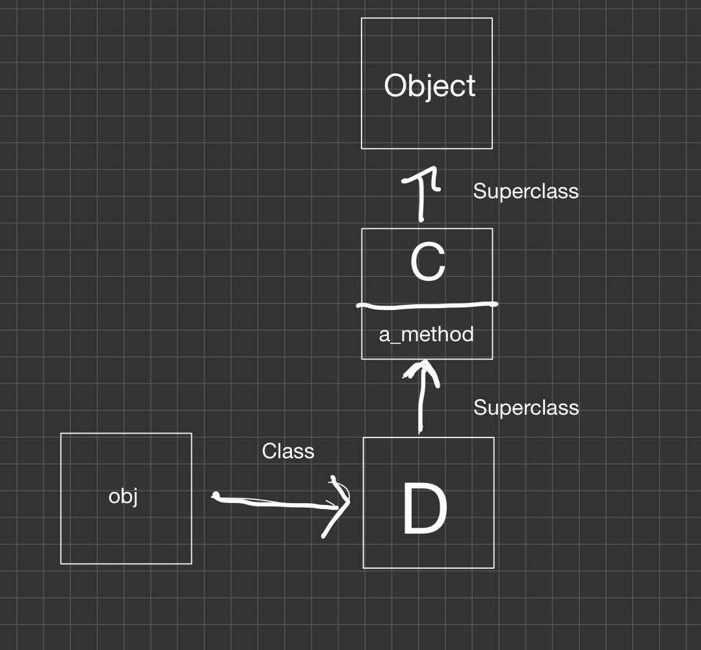
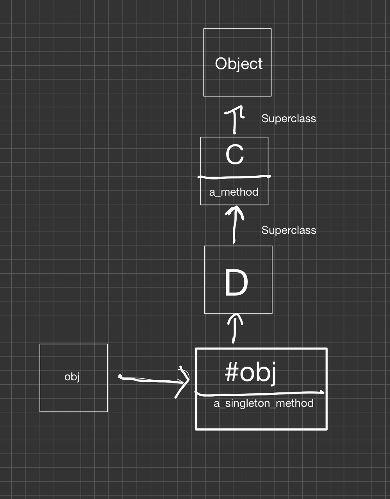
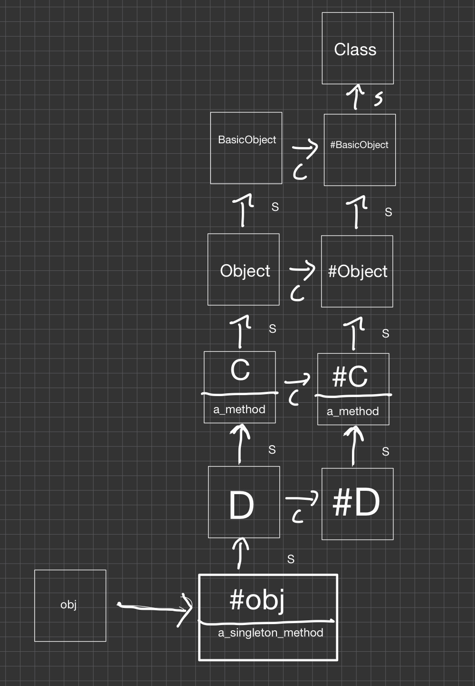

# Class Definitions

- 일반적인 프로그래밍 언어에서의 클래스는 클래스의 객체를 만든 다음 해당 객체의 메서드를 호출할 때까지 실제로 아무 일도 일어나지 않는다.
- 루비에서는 다르다, 객체의 향후 동작 방식만 지시하는 것이 아닌 코드를 실제로 싱행한다.
- 클래스 매크로와 별칭에 대한 것을 배울 예정
- 싱글톤 클래스에 대해서도 설명

## 클래스 정의 이해하기

### 클래스 정의 내부

```ruby
class MyClass
  puts 'Hello'
end
❮ Hello
```

- 클래스 정의에 원하는 코드를 넣을 수 있다.

```ruby
result = class MyClass
    self
end
result # => MyClass

```

- 클래스 정의도 메서드처럼 마지막 라인을 반환한다.
- 클래스 정의에서 클래스 자체는 현재 객체로써 역할을 수행함
- 클래스와 모듈은 객체일 뿐인데 왜 self가 될 수 없나?
- 일단 킵

### The Current Class

- 알다시피 루비에서는 어디든 self를 갖고있다. 마찬가지로 항상 **current class**가 있다.
- 메서드를 정의하면 해당 메서드가 현재 클래스의 인스턴스 메서드가 된다.
- self로 현재 객체에 대한 참조를 가져올 수 있지만 **current class**에 대한 참조를 갖고 오는 키워드는 없다.
  - 최상위 레벨에서의 current class는 Object이다. 따라서 최상위에서 메서드를 정의하면 Object의 인스턴스 메서드가 된다.
  - 메서드에서 current class는 오브젝트의 클래스이다.
  - 클래스 키워드가 있는 클래스를 열면 해당 클래스가 current class가 된다
- 클래스 키워드는 클래스 이름이 필요하다는 한계

```ruby
def add_method_to(a_class)
  # TODO: define method m() on a_class
end
```

- 현재 클래스를 변경하려면 클래스 키워드 이외의 방법이 필요하다.

#### class_eval()

`Module#class_eval` 은 기존 클래스의 컨텍스트에서 블록은 evaluate한다.

```ruby
def add_method_to(a_class)
  a_class.class_eval do
    def m; 'Hello!'; end
  end
end
add_method_to String
"abc".m   # => "Hello!"
```

- `instance_eval` 하고는 매우 다름 얘는 object만 변경, class_eval은 전부 변경
  - 펙트는 아닌데 일단 뒤에서 더 설명
- class_eval은 current class를 변경하여 클래스 키워드처럼 클래스를 다시 연다.
- class 보다 더 유연하다
  - class는 상수를 필요하지만 class_eval은 모든 변수에 사용 가능
  - class는 current binding을 볼 수 없지만 class eval은 플랫 스코프를 가짐 - 외부 스코프의 변수 참조 가능
  - class_exec 메서드도 있다.

### Current class Wrap-up

- 루비 인터프리터는 항상 current class에 대한 참조를 유지한다. def로 정의된 메서드는 current class의 인스턴스 메서드가 된다.
- 클래스 정의에서 현재 객체 self와 current class는 동일하다.
- 클래스에 대한 참조가 있으면 class_eval로 클래스를 열 수 있다.

### 클래스 인스턴스 변수

- 루비 인터프리터는 모든 인스턴스 변수가 현재 객체 self에 속한다고 가정한다, 클래스에서도 마찬가지

```ruby
class MyClass
  @my_var = 1
  def self.read; @my_var; end
  def write; @my_var = 2; end
  def read; @my_var; end
end
obj = MyClass.new
obj.read # => nil
obj.write
obj.read # => 2
MyClass.read # => 1
```

- self는 클래스 자체이니까 인스턴스 변수 `@my_var` 는 클래스에 속한다.
- 클래스의 인스턴스 변수는, 클래스 객체의 인스턴스 변수와 다르다
- 두 개의 인스턴스 변수를 정의한 것 같은 이름이지만 서로 다른 범위, 서로 다른 객체
- 클래스는 단지 객체임을 기억하고, self를 트래킹 해야함
- obj을 self로 두느냐, MyClass를 self로 두느냐.
- static field같은거임

```ruby
class C
  @@v = 1
end

class D < C
  def my_method; @@v; end
end
D.new.my_method # => 1
```

- 이게 더 스태틱변수같긴한데, 서브 클래스에서 접근 가능함

```ruby
@@v = 1
class MyClass
  @@v = 2
end
@@v #=>2
```

- 하지만 쫌 ..

- 클래스 변수가 클래스에 속하는 것이 아닌 클래스 계층에 속하기 때문
- @@v는 main context에서 정의가 되므로 Object에 속한다.
- 그리고 모든 Object의 후손들에게 ... MyClass는 Object를 상속하므로 동일한 클래스 변수를 공유
- 그래서 대부분 클래스 변수를 피함, 최상위에서는 클래스 변수를 못쓰게 함

### bookworm

```ruby
class Loan
  def initialize(book)
    @book = book
    @time = Time.now
  end
  def to_s
    "#{@book.upcase} loaned on #{@time}"
  end
end
```

- Loan은 책 제목과 대출된 시간을 저장
- to_s의 테스트를 작성하려면 객체가 생성된 정확한 시간을 알아야한다.
- 하지만 매번 다른 결과이므로 ...

```ruby
class Loan
  def initialize(book)
    @book = book
    @time = Loan.time_class.now
  end
  def self.time_class
    @time_class || Time
  end
def to_s
# ...
```

- time_class는 클래스를 반환하고 해당 클래스로 현재 시간을 갖고온다.
- nil gurad로 인해 @time_class가 없으면 Time을 기본값으로 반환
- 단위 테스트에선 항상 동일한 값을 반환하는 가짜 시간 클래스에 의존할 수 있다.

```ruby
class FakeTime
  def self.now; 'Mon Apr 06 12:15:50'; end
end

require 'test/unit'
class TestLoan < Test::Unit::TestCase
  def test_conversion_to_string
    Loan.instance_eval { @time_class = FakeTime }
    loan = Loan.new('War and Peace')
    assert_equal 'WAR AND PEACE loaned on Mon Apr 06 12:15:50', loan.to_s
  end
end
```

## 싱글톤 메서드

- Paragraph 클래스는 문자열을 줄 바꿈한 다음 모든 호출을 줄 바꿈 문자열에 위임한다.
  - title?은 문단이 모두 대문자이면 트루

```ruby
class Paragraph
  def initialize(text)
    @text = text
  end
  def title?; @text.upcase == @text; end
  def reverse; @text.reverse; end
  def upcase; @text.upcase; end
  #...

end
# ...
def index(paragraph)
  add_to_index(paragraph) if paragraph.title?
end
# ...
```

- Paragraph는 한 곳에서 생성되고 title? 메서드는 인덱스라는 메서드에서 한 번만 호출된다
- 이게 필요한가? 그냥 스트링 클래스를 몽키패치해서 title? 메서드를 추가?
- 하지만 paragraph을 나타내는 문자열에서만 의미가 있고 다른 문자열에서는 의미가 없다.

- 하나의 객체에 메서드를 추가하기

```ruby
str = "just a regular string"
def str.title?
  self.upcase == self
end
str.title? # => false
str.methods.grep(/title?/) # => [:title?]
str.singleton_methods# => [:title?]
```

- `Object#define_singleton_method` 를 통해서 싱글톤 메서드를 정의할 수 있다.

```ruby
paragraph = "any string can be a paragraph"
def paragraph.title?
  self.upcase == self
end
index(paragraph)
```

### 클래스 메서드의 진실

- Object Model에서 배운 내용을 기억하나? 클래스는 객체이고 클래스 이름은 상수이다.
  - 클래스에서 메서드를 호출하는 것과 객체에서 호출이 같다라는 것을 알 수 있다.

```ruby
an_object.a_method
AClass.a_class_method
```

- 하지만 싱글톤 메서드? 그게 바로 클래스 메서드!! - 클래스의 싱글톤 메서드이다.

```ruby
def obj.a_singleton_method; end
def MyClass.another_class_method; end
```

- 앞의 정의에서 객체는 객체 참조, 상수 클래스 이름, 또는 그 자체일 수 있다. 구문은 다를 수 있지만 기본 메커니즘은 동일하다.

### 클래스 매크로

#### attr_accessor() example

```ruby
class MyClass
  def my_attribute=(value)
    @my_attribute = value
  end
   def my_attribute
    @my_attribute
  end
end
obj = MyClass.new
obj.my_attribute = 'x'
obj.my_attribute
```

- 루비의 객체에는 속성이 없다.
- 모방 메서드인 reader, writer를 정의 해야한다.
- 위와 같은 정의는 금방 지루하다.

```ruby
class MyClass
  attr_accessor :my_attribute
end
```

- attr_accessor은 w/r
- attr_reader는 r
- attr_writer 는 w를 생성
- attr\_\*은 모듈 class에 정의되어 있으므로 모듈 또는 클래스일 때 사용 가능하다.
- 이러한 메서드를 클래스 매크로라고 한다.
- 키워드 처럼 보이지만 클래스 정의에 사용되는 메서드 일 뿐이다.

#### Class Macros Applied

- 북 클래스에는 몇가지 메서드가 있다, 이 메서드 이름을 바꾸면 호출자가 끊어지므로...
- GetTitle -> title, LEND_TO_USER -> lend_to, title2 -> subtitle
- 이전 이름을 deprecate 클래스 매크로로 메서드 이름을 바꿀 수 있다

```ruby
class Book
  def title # ...
  def subtitle # ...
  def lend_to(user)
    puts "Lending to #{user}"
    # ...
  end
  def self.deprecate(old_method, new_method)
     define_method(old_method) do |*args, &block|
      warn "Warning: #{old_method}() is deprecated. Use #{new_method}()."
      send(new_method, *args, &block)
  end
  end
    deprecate :GetTitle, :title
    deprecate :LEND_TO_USER, :lend_to
    deprecate :title2, :subtitle
end
b = Book.new
b.LEND_TO_USER("Bill")
❮ Warning: LEND_TO_USER() is deprecated. Use lend_to(). Lending to Bill
```

- 이전 이름에 대한 호출을 탐지하는 동적 메서드를 정의
- 경고창을 정의
- 클래스 매크로를 사용하는 기발한 방법

## 싱글톤 클래스

### 싱글톤 메서드의 미스테리

- Method Lookup에서 수신자의 클래스로 이동한 다음 클래스 계층 위로 올라가서 메서드를 찾는 방법을 배웠다.

```ruby
class MyClass
    def my_method; end
end
obj = MyClass.new
obj.my_method

def obj.my_singleton_method; end

```

- 싱글톤 메서드에서는?
- obj는 클래스가 아니므로 obj에서 살 수 없다.
- MyClass나 Object에서도 마찬가지, 모든 클래스에 적용이 되어버리므로
- 보이는 클래스 대신 객체는 자신만의 특수한 숨겨진 클래스를 가질 수 있다 -
  - 이를 싱글톤 클래스라고 한다 ( 메타클래스 혹은 고유 클래스라고 부르기도 한다.)

```ruby
class << an_object
  # your code here
end
```

- 싱글톤 클래스에 대한 참조를 가져오려면 스코프에서 자체적으로 반환 가능하다.

```ruby
obj = Object.new
singleton_class = class << obj
  self
end
singleton_class.class   # => Class

"abc".singleton_class    # => #<Class:#<String:0x331df0>>
```

- `Object#singleton_class` 로도 얻을 수 있다.
- 싱글톤 클래스는 << 구문 혹은 singleton_class 메서드를 사용 전에는 볼 수 없음
- 단일 인스턴스에만 있고 상속될 수 없다.
- 싱글톤 클래스는 객체의 싱글톤 메서드가 존재하는 곳이다.

```ruby
def obj.my_singleton_method; end
singleton_class.instance_methods.grep(/my_/)  # => [:my_singleton_method]
```

### 메서드 조회 다시 보기

- 예전 장에서 메서드 호출 시 발생하는 현상에서는 루비 객체 모델과 메서드 조회에 대해 배웠다.

#### 메서드 조회 리뷰

```ruby
class C
  def a_method
    'C#a_method()'
  end
end
class D < C; end
obj = D.new
obj.a_method    # => "C#a_method()"
```



#### 싱글톤 클래스와 매서드의 조회

```ruby
obj = Object.new
obj.singleton_class  # => #<Class:#<Object:0x007fd96909b588>>
```

- #이 붙어있으면 싱글톤 클래스를 의미한다고 해보자
  - #obj은 obj의 싱글톤 클래스 #C는 C의 싱글톤 클래스

```RUBY
class << obj
  def a_singleton_method
    'obj#a_singleton_method()'
  end
end
```

- 싱글톤 클래스도 클래스이니 슈퍼 클래스가 있어야지?

```ruby
obj.singleton_class.superclass   # => D
```



#### 싱글톤 클래스 및 상속

```ruby
class C
  class << self
    def a_class_method
      'C.a_class_method()'
    end
  end
end
C.singleton_class# => #<Class:C>
D.singleton_class# => #<Class:D>
D.singleton_class.superclass# => #<Class:C>
C.singleton_class.superclass# => #<Class:Object>

```



- C는 싱글톤클래스
- S는 슈퍼클래스
- 이 다이어그램은 모듈이 포함되어있지 않다. 완전히 그리려면 Object와 BasicObject사이에 Kernel모듈을 그릴 수 있지만 굳이,
- 모듈들은 다른 객체들처럼 싱글톤 클래스를 가질 수 있지만 커널의 싱글톤 클래스는 obj나 #D의 상위 체인의 일부가 아니다.
- 싱글톤의 슈퍼클래스는 싱글톤클래스
- 이런 배열 덕분에 하위 클래스에서 클래스 메서드 호출이 가능한 것

```ruby
D.a_class_method # => "C.a_class_method()"
```

- a_class_method 가 C에 정의되어 있더라도 D에도 호출이 가능하다.
- 메서드 조회가 #D에서 시작하여 #D의 #C로 올라가서 메서드를 찾기 때문에 가능하다.

#### The Great Unified Theory

- 클래스, 싱글톤 클래스, 모듈이 있다.
- 인스턴스 메서드, 클래스 메서드, 싱글톤 메서드가 있다.
- 싱글톤 클래스를 클래스와 모듈과 함께 사용하면 루비 객체 모델의 7가지 규칙이 나온다.

1. 객체는 한 가지 종류만 있다. 일반 객체 혹은 모듈
2. 모듈은 한가지 종류만 있다. 일반 모듈, 클래스 또는 싱글톤 클래스
3. 한 가지 종류의 메서드가 있다. - 모듈에서 살고 대부분 클래스 안에 있다.
4. 모든 객체, 클래스는 실제 클래스를 가진다 - 일반 클래스 혹은 싱글톤 클래스
5. BasicObject를 제외한 모든 클래스에는 정확히 하나의 상위 클래스가 있다. - 즉 모든 클래스의 상위 항목부터 BasicObject까지의 체인을 가짐
6. 객체의 싱글톤 클래스의 슈퍼클래스는 객체의 클래스이다. 한 클래스의 싱글톤 슈퍼클래스는 그 클래스의 싱글톤 클래스이다.
7. 메서드를 호출하면 오른쪽으로 클래스로, 이동한 다음 조상 체인을 올라간다.

#### Class Methods Syntaxes

- 클래스 메서드는 클래스의 싱글톤 클래스에 있는 싱글톤 메서드이므로 이제 세 가지 방법을 사용 가능

```ruby
def MyClass.a_class_method; end
class MyClass
  def self.another_class_method; end
end
class MyClass
  class << self
    def yet_another_class_method; end
  end
end
```

- 첫 번째는 클래스 이름이 중복되어 래팩터링이 어려우므로 ..
- 세 번째는 trickiest , 싱글톤 클래스를 열고 메서드를 정의,
  - 싱글톤 클래스를 명시적으로 인정하므로 쫌 치는 느낌이 난다.

#### 싱글톤 클래스와 instance_eval()

- instance_eval은 객체만 변화하고 class_eval은 자신과 current class 모두 변화한다고 배웠다.
- 하지만 instance_eval은 current class도 변경한다 - 수신자의 싱글톤 클래스도 변경한다.

```ruby
s1, s2 = "abc", "def"
s1.instance_eval do
  def swoosh!; reverse; end
end
s1.swoosh!                # => "cba"
s2.respond_to?(:swoosh!)  # => false
```

#### 클래스 속성

- attr\_\*을 기억하는가?

```ruby
class MyClass
  attr_accessor :a
end
obj = MyClass.new
obj.a = 2
obj.a
```

- 대신 클래스에 속성을 정의하려면?

```ruby
class MyClass; end
class Class
  attr_accessor :b
end
MyClass.b = 42
MyClass.b      # => 42
```

- 동작이야 하겠지만 모든 클래스에 속성이 추가됨, MyClass에 특화된 속성을 원한다면..

```ruby
class MyClass
  class << self
    attr_accessor :c
  end
end
MyClass.c = 'It works!'
MyClass.c
```

- attribute는 단지 한쌍의 메서드이다.
- 이런 메서드를 정의하면 클래스 메서드가 되는 것

```ruby
def MyClass.c=(value)
  @c = value
end
def MyClass.c
  @c
end
```

## Method Wrappers

```ruby
def deserves_a_look?(book)
  amazon = Amazon.new
  amazon.reviews_of(book).size > 20
end
```

- 라이브러리 사용 예시
- 대부분 작동하지만 예외 관리가 안된다.
- Amazon이 원격 호출이 실패하면 이 문제를 기록하고 진행해야한다.
- 라이브러리를 직접 수정하고 싶지 않다 라는 문제
- 모든 클라이언트가 자동으로 추가 기능을 사용할 수 있도록 메서드를 사용하여 추가 기능을 래핑하려고 한다.

### Around Aliases

- 별칭 사용이 가능하다

```ruby
class MyClass
  def my_method; 'my_method()'; end
  alias_method :m, :my_method
end
obj = MyClass.new
obj.my_method   # => "my_method()"
obj.m           # => "my_method()"

class MyClass
  alias_method :m2, :m
end
obj.m2           # => "my_method()"
```

- 흔한 예시임, String#size, String#length, Integer클래스는 5개 이상의 다른 이름을 가진 메서드를 갖고있다.

```ruby
class String
  alias_method :real_length, :length
  def length
    real_length > 5 ? 'long' : 'short'
  end
end
"War and Peace".length      # => "long"
"War and Peace".real_length # => 13
```

- method를 재정의하지만 별칭은 여전히 원래 메서드를 참조한다.
- 재정의 시 메서드는 실제로 변경되지 않는다. 기존 이름을 해당 새 메서드에 연결할 뿐
- 흥미로운 예시임

### The Thor Example

- cli utilities를 만드는 잼임
- Rake2thor라는 프로그램이 포함되어 있는데 이 프로그램은 빌드 파일을 토르 스크립트로 변환함
- Rake2thor는 레이크 파일을 로드하고 해당 레이크 파일에 필요한 모든 파일의 이름을 저장해야한다.

```ruby
input  = ARGV[0] || 'Rakefile'
$requires = []
module Kernel
  def require_with_record(file)
    $requires << file if caller[1] =~ /rake2thor:/
    require_without_record file
  end
  alias_method :require_without_record, :require
  alias_method :require, :require_with_record
end
load input
```

- 필요한 파일의 이름을 저장할 글로벌 어레이를 준비하고, 커널 모듈을 열고 메서드 별칭으로 몇 가지 트릭을 쓴다.
- 그러고 마지막으로 rakefile을 로드한다.

```ruby
module Kernel
  alias_method :require_without_record, :require
  def require(file)
    $requires << file if caller[1] =~ /rake2thor:/
    require_without_record file
  end
end
```

- 단순화된 버전임
- 위의 오픈클래스는 세 가지 일을 함
  1. Kernel#require 을 다른 이름으로 별칭화
  2. Monkeypatch는 rakefile에 필요한 require하는 이름들을 저장한다.
  3. 마지막으로 원래 요구사항으로 돌아가고, 걔는 require_without_record라고 불리는 메서드로 별칭
- 이 속임수를 around alias로 부름

- Around Alias 작성법
  1. Alias a method
  2. Redefine it
  3. Call the old method from the new method
- additional method name으로 클래스를 오염시킨다.
  - 구 버전의 메서드를 별칭으로 지정한 후 비공개로 만들면 해결 가능
- 로딩과 관련된 잠재적인 문제, around method를 두 번 로드하면 안된다.
- Monkey patch의 한 형태이다..... 따라서 이런 추가적인 기능을 래핑하는 두 가지 방법을 추가로 도입

### More Method Wrappers

```ruby
module StringRefinement
  refine String do
    def length
      super > 5 ? 'long' : 'short'
    end
  end
end
using StringRefinement
"War and Peace".length      # => "long"
```

- around alias보다는 일반적으로 안전하다.
- 파일 끝, 혹은 모듈 정의 까지만 정의됨

```ruby
module ExplicitString
  def length
    super > 5 ? 'long' : 'short'
  end
end
String.class_eval do
  prepend ExplicitString
end
"War and Peace".length      # => "long"
```

- prepend wrapper로 사용 가능함
- 로컬적이지는 않지만 refine이나 어라운드 별칭보다 더 깨끗하고 명확하다고 여겨진다.

### Solving the Amazon Problem

```ruby
module AmazonWrapper
  def reviews_of(book)
    start = Time.now
    result = super
    time_taken = Time.now - start
    puts "reviews_of() took more than #{time_taken} seconds" if time_taken > 2
    result
  rescue
    puts "reviews_of() failed"
    []
  end
end
Amazon.class_eval do
  prepend AmazonWrapper
end
```

## Wrap-Up

- 클래스 정의에서의 self ( 메서드 호출의 기본 수신기 ) 및 current class ( 정의하는 메서드의 기본 홈 ) 에 미치는 영향
- signle tone method 및 signleton 클래스를 통해 객체 모델 및 메서드 검색에 대한 새로운 인사이트
- 클래스 인스턴스 변수, 클래스 매크로 및 래퍼를 포함한 여러가지 트릭
- 클래스에 대해 배운 모든 것을 모듈에 적용 가능함 - 클래스 인스턴스 변수는 모듈 인스턴스 변수일 수 있음
