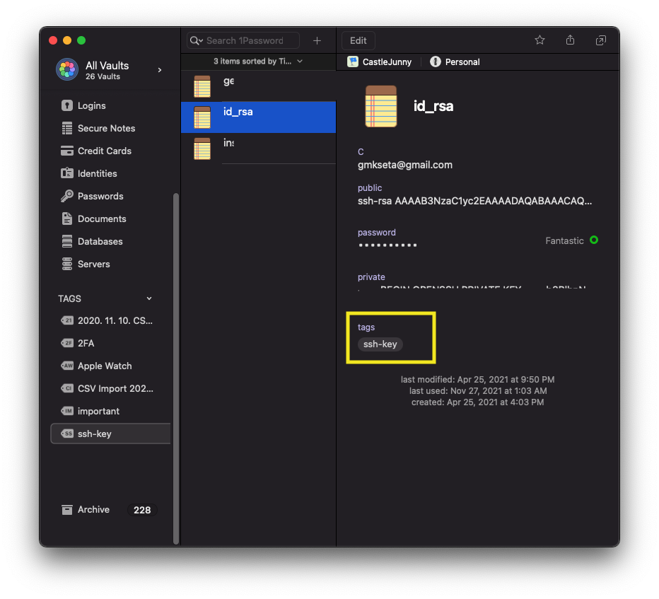
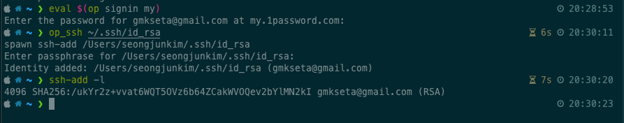

- ssh key를 비밀번호 없이 사용하는 경우가 많았다. 혹은 항상 쓰던 비밀번호를 썼다.
- 회사, 개인, 사이드플젝, 외주 등 각각 ssh-key를 따로 관리했는데 비밀번호를 안 쓰는 것에 죄책감을 느끼기 시작함
- 만약 노트북이 열린 채로 털리면 터미널 히스토리 보고 서버 접속 가능할 듯?
- 1password를 결제해서 쓰고 있는데 1password cli를 사용해서 어떻게 못 할까?

라는 니즈에서 스크립트를 짜놓고 작년부터 썼는데 이제 글로 옮겨적기

## 1password 란?

- 1password는 패스워드를 관리하는 프로그램이다.
- 패스워드 및 각종 신용카드 정보나 민감한 개인 정보들을 관리하고 쉽게 사용할 수 있다.
- mac, window, android, iphone, 크롬 확장프로그램, cli에서도 사용 가능하다.
- 모든 사이트의 비밀번호를 다르게 사용해도 1password를 사용해서 auto complete를 할 수 있다.

## Need to be installed - expect, op

- 1password cli ( op ), jq, expect 가 설치되어있어야 한다.

### expect

- **macos** - 맥에선 원래 expect가 설치 되어있다. ㅎㅎ
- **ubuntu** - `sudo apt-get install expect`

### 1password command line

- [1password cli](https://1password.com/downloads/command-line/) 에서 설치!

### jq

- `brew install jq`

## ssh-key 저장해두기

1. 비밀번호를 굉장히 복잡하게 설정하거나 1password으로 만들어냅니다.

2. `ssh-keygen` 을 통해 ssh-key를 하나 생성하고 비밀번호를 1.의 비밀번호로 설정합니다.

3. 1password에 저장합니다.
   - public key와 private key도 저장해두면 pc가 뿌셔져도 괜찮습니다.
   - **tags를 꼭 ssh-key 로 해둡니다.**



## script

- 아래 스크립트를 아무 곳에나 잘 위치 시키고 ( 나는 `~/.custom/op_ssh.sh` 로 해뒀음)
- 실행 권한을 준다.

  - `chmod +x 파일명.sh`

- `alias` 를 설정한다.
  - `alias op_ssh=~/.custom/op_ssh.sh`

```sh
#!/bin/bash

if [ $# -eq 0 ]; then
  echo "ssh path 경로 없음"
else
  ssh_path="${1}"
  title="$(echo $ssh_path | tr '/' '\n' | tail -n1)"
  uuid=$(op list items --tags ssh-key | jq --arg title "$title" '.[] | select(.overview.title == $title).uuid' | sed -e 's/^"//' -e 's/"$//')
  if [ -z "$uuid" ]; then
    echo "Need 1password Sign In"
  else
    password=$(op get item $uuid | jq '.details.sections[1].fields[] | select(.t == "password").v' | sed -e 's/^"//' -e 's/"$//')
    expect <<EOL
  spawn ssh-add $ssh_path
  expect "Enter passphrase for *"
  send "$password"
  send "\n"
  expect "Identity added: *"
EOL
  fi
fi

```

## 사용

- op cli 로그인을 한다.
- 로그인 하고자하는 키의 경로를 매개변수로 두고 커맨드 실행



## next?

1. gist 올려두고 자동화

2. 1password 비밀번호 입력도 불편하다, touch id로 안 되나?
