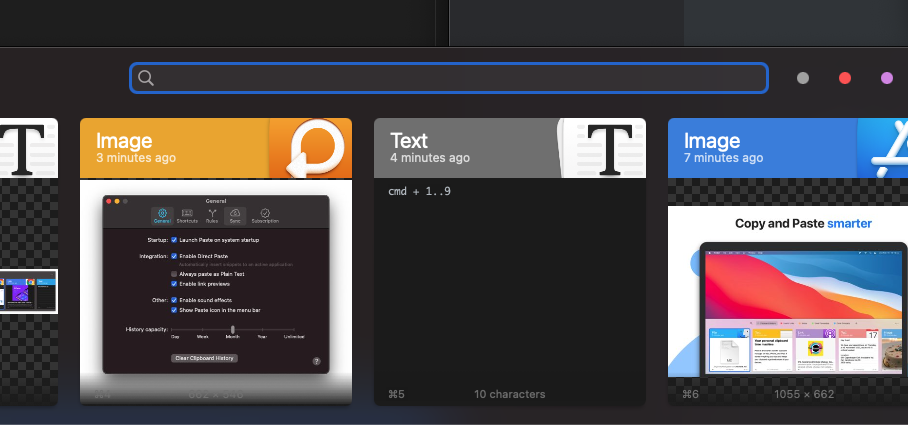

- 클립보드의 히스토리를 관리할 수 있는 [Paste](https://pasteapp.io/) 앱이다. 내가 기기에서 복사했던 (`ctrl+c`) 기록, 이에 대한 분류 및 검색 기능을 제공한다. 
- MacOS / IOS 에서 사용 가능하며 구독형으로 21'01.13 기준으로 **13,500₩/year** 이다.

## 기능

### 클립보드 히스토리 기록

- 복사 (`ctrl+c`) 를 했던 기록을 저장하고 설정해놓은 단축키( Default : `cmd+shift+v`) 를 누르면 사진과 같은 리스트가 표시된다. 리스트를 보고 원하는 기록을 선택하면 붙여넣기가 된다.
- `cmd + 1..9` 으로 바로 붙여넣을 수도 있다. `shift + cmd + 1..9` 으로는 Plain Text로 붙여넣는다.

- 복사한 컨텐츠가 링크라면 자동으로 메타데이터를 긁어와서 미리보기를 보여주기도 한다. 또한 복사 기록에 대한 저장 기간도 설정할 수 있다.

### 검색기능

- 돋보기 모양을 누르거나 Paste를 활성화한 후에 `cmd+f` 를 누르면 검색 기능을 사용할 수 있다.
- 기본적으로 **내용에 대한** 검색도 가능하지만, 복사한 **컨텐츠의 형식**과 복사한 **어플리케이션으로**도 **검색**이 가능하다.

#### ex

### Pin

- 사진의 오른쪽 위에 `+` 를 눌러서 pin board를 만들고 복사한 컨텐츠를 드래그해서 해당 pin board에 넣어둘 수 있다.
- 자주 쓰는 코드나 텍스트 템플릿 등을 저장하고 쓰면 편하다!

### Paste Stack

- 복사 붙여넣기를 특정 순서로 텍스트, 이미지, 링크 등 여러 항목을 동시에 붙여넣을 수 있는 기능이다. 사실 나는 불편해서 잘 안 쓰지만, 활용을 잘하면 좋을 것 같다.
- 자세한 건 링크 참고 https://medium.com/pasteapp/copy-copy-copy-paste-paste-paste-56068d2150c2

### IOS 및 Siri 지원

- IOS 앱도 있고, 위젯을 사용하면 꽤나 편리하다.

### macOs Monterey Shortcuts

- 이건 사실 잘 모른다... 아직 빅서에서 업데이트를 안해서,....
- 링크 참고! https://medium.com/pasteapp/paste-with-shortcuts-for-macos-monterey-f74b68bd7d91

## 경험담

## 

- 내가 이 앱을 설치한 건 19년 8월이었다. 여러 내용을 복사 붙여넣기 할 때 따로 `Typora`를 키거나 메모장을 켜서 잠시 복사한 내용을 저장해두다가 불편해서 관련 앱을 찾았다.

- 그때 당시에는 19,000원으로 한 2주 정도 Trial 기간을 줬는데 하루정도 쓰고 그냥 바로 결제했다. 내가 필요했던 기능을 너무 잘 제공해줬고 UI/UX 측면 다른 클립보드 히스토리 관리 앱들에 비해 압도적으로 편리했다.
- 이 앱을 따라 한 무료 앱들이 매우 많았지만, 기능적으로나 성능적으로 원본 앱을 따라올 수 없었다.

### 구독형으로 전환

- 20년 2월부터 Paste는 구독형으로 전환하였다.
- 이전에 구매한 이들에게는 소정의 무료 기간을 줬지만, 반발이 꽤 심했다.. 구독으로 전환한다는 미디엄 글에 댓글이 다들 부정적인 의견이었고 삭제하고 다른 어플로 갈아탄다는 댓글이 대부분이었다.
- 사실 이미 구매한 사람들은 업데이트하지 않으면 구독 없이 사용할 수 있었다.

## My two cents

일단 나는 소프트웨어를 사는 것에 있어서 최대한 돈을 아끼지 않으려고 한다. 

내 주변에서는 소프트웨어 혹은 게임을 돈 주고 구매하는 것에 대한 거부감을 갖고있는 사람이 많다.  개발자로써 조금 안타까운일이라고 생각한다.

매번 어플을 살 땐 이 어플을 만들 때 든 개발자의 노고를 생각해보곤 한다. 이 어플을 만드는 개발자의 노동력의 대가로 생각했을 때 그 값이 맞을까? 라고 말이다.

어떤 어플에 대한 아이디어에 필요성을 느끼곤 "와 사이드 프로젝트로 할만한 주제인데?" 하고 막상 검색해보면 너무나 잘 만든 앱이 있어서 기분 좋게 쓰곤 했기 때문이다. 아, 내가 만들었으면 몇 달은 걸렸을 텐데 하고 말이다.

그래서 그런지 이 어플이 그 정도 값어치를 하는가? 에 대한 질문은 오히려 더 받아야 한다는 의견이었기도 하고, 구독형 전환 때문에 개발자들이 더 이 프로덕트에 집중하여 더 좋은 프로덕트로 개선이 된다면 좋다는 생각에 역시 바로 구독으로 전환하여 잘 사용하고 있다.

## LINK

* 공식 홈페이지 https://pasteapp.io/
* App Store https://apps.apple.com/kr/app/paste-clipboard-manager/id967805235?l=en

## Alternative

* https://apps.apple.com/kr/app/upaste-clipboard-manager/id1503649026 - 무료
* https://snark.github.io/jumpcut/ - 무료 OpenSource
* https://apps.apple.com/app/copyclip-clipboard-history/id595191960 - 무료
* https://apps.apple.com/app/copyclip-2-clipboard-manager/id1020812363 - 7.79$

