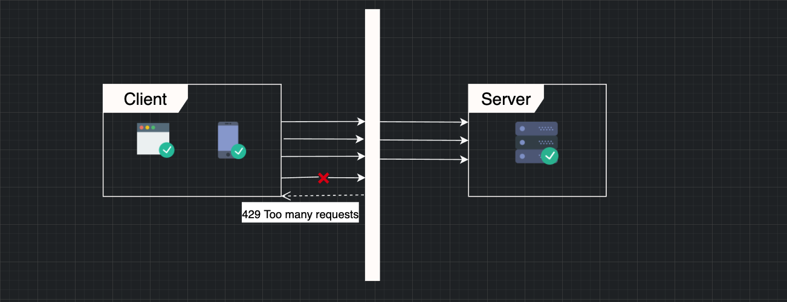
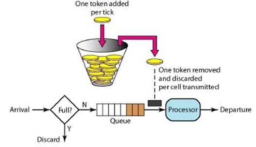
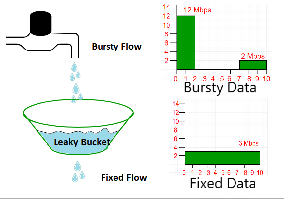
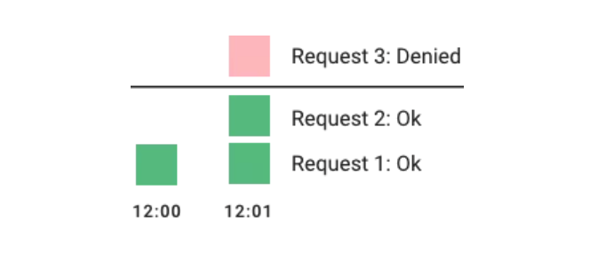
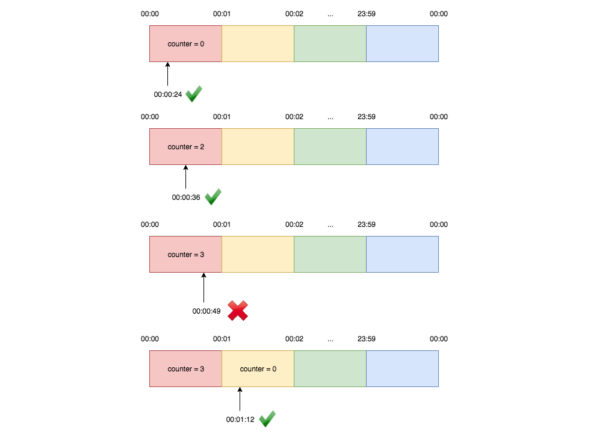
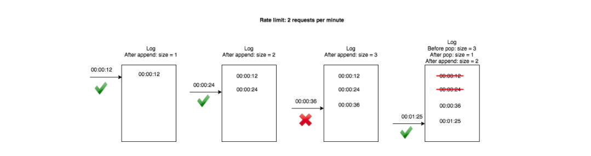

## 처리율 제한 장치(rate limiter)란?

- 클라이언트 또는 서비스가 보내는 트래픽의 처리율을 제어하기 위한 장치이다.
- 특정 기간 내에 전송되는 클라이언트의 요청 횟수를 제한한다.
- 요청 횟수가 임계치(threshold)를 넘어서면 추가로 도달한 모든 호출은 처리가 중단(block)된다.
- 오픈 API나 외부에 특정 API를 제공하는 서비스의 경우 시간당 몇 회 호출이나 하루에 몇 회 호출 등의 제한을 걸어두곤 한다.

## 왜 처리율 제한이 필요한가??

- DoS(Denial of Service) 공격에 의한 자원 고갈을 방지할 수 있다. 과한 트래픽으로 부터 서비스를 보호한다.
- 비용을 절감한다. 추가 요청에 대한 처리를 제한하면 서버를 많이 두지 않아도 되고, 우선순위가 높은 API에 더 많은 자원을 할당할 수 있다.
- 초과하는 횟수에 따라 과금하는 비즈니스 모델로 활용이 가능하다.
- 서버 과부하를 막는다. 봇애서 오는 트래픽이나 사용자의 잘못된 이용 패턴으로 유발된 트래픽을 걸러내는데 사용 가능

## 처리율 제한 장치의 위치

### 서버에서의 처리율 제한

- 처리하고자 하는 조건에 따라 서버측에서 제한을 건다.

### 미들웨어에서의 처리율 제한

- 미들웨어에서 API 서버로 가는 요청을 통제한다.
- 요청이 너무 많이오면 429 code (Too many requests)를 리턴해준다.
  

### 클라이언트에서의 처리율 제한 장치

- 클라이언트의 요청은 쉽게 위변조가 가능해서 안정적으로 처리율 제한을 걸 수 없다.
- 하지만 꼭 클라이언트가 어플이나 브라우저가 아닌 서버일 수 있음 (소비자)
- 제공자는 그냥 거절하면 그만이지만 클라이언트에서는 다양한 방법을 사용 가능
  - 다시 요청할 수 있을 때까지 대기
  - 일정 시간 기다린 후 그때도 통과를 못한다면 타임아웃 처리
  - 요청 취소

## 처리율 제한 알고리즘

### 1. Token Bucket

- 토큰 버킷은 지정된 용량을 갖는 컨테이너이고, 이 버킷에는 설정된 양의 토큰이 주기적으로 채워진다.
- 토큰이 꽉 차있으면 더 이상 토큰은 추가되지 않는다.
- 요청이 들어오면 버킷에 토큰이 있는지 확인한다.
  - 충분한 토큰이 있으면 하나의 토큰을 버리고 요청을 처리한다.
  - 토큰이 없으면 요청은 버려진다.

- 가장 간단하고 보편적으로 쓰인다.
- 통상적으로 엔드포인트마다 별도의 버킷을 둔다.
  - IP별로 처리율을 제한하고 싶다면 IP주소마다 버킷을 하나씩 할당한다.
  - 시스템의 처리율을 제한하고 싶다면 모든 요청이 하나의 버킷을 공유하도록 한다.
- 버킷의 크기, 토큰 공급률을 인자로 받는다

#### 장점

- 구현이 쉽다.
- 메모리 사용 측면에서도 효율적이다.
- 짧은 시간에 집중되는 트래픽도 처리 가능하다. 버킷에 남은 토큰이 있기만 하면 요청은 시스템에 전달된다.

#### 단점

- 버킷의 크기와 토큰 공급률이라는 인자를 적절하게 튜닝하는게 까다롭다.

### 2. Leaky Bucket

- 요청이 도착하면 큐가 가득 차 있는지 본다. 빈 자리가 있는 경우에는 큐에 요청을 추가한다.
- 큐가 가득 차 있는 경우에는 새 요청은 버린다.
- 지정된 시간마다 큐에서 요청을 꺼내어 처리한다.

- 토큰 버킷 알고리즘과 비슷하지만 요청 처리율이 고정되어있다.
- 보통 FIFO로 구현한다.
- 버킷 크기, 처리율을 인자로 받는다.

#### 장점

- 큐의 크기가 제한되어 있어 사용량 측면에서 효율적이다.
- 고정된 처리율을 갖고 있으므로 안정적인 출력이 가능하다.

#### 단점

- 단시간에 많은 트래픽이 몰리는 경우 큐에는 오래된 요청들이 쌓이게 되고, 그 요청들을 제때 처리 못하면 최신 요청들이 버려진다.
- 버킷 크기, 처리율을 튜닝하기 까다롭다.

### 3. Fixed Window Counter

- 타임라인을 고정된 간격의 window로 나누고 각 window마다 counter 를 붙인다.
- 요청이 접수될 때마다 이 counter값은 1씩 증가한다.
- 이 counter 값이 threshold 에 도달하면 새로운 요청은 새 윈도가 열릴 때까지 버려진다.

- 매 초마다 할당량 이상이 오면 초과분은 버려진다.
- 이 알고리즘의 가장 큰 문제는 경계 시간대에 몰리면 window에 할당된 양보다 더 많은 요청이 처리될 수 있다.

#### 장점

- 메모리 효율이 좋다.
- 이해하기 쉽다.
- window가 닫히는 시점에 카운터를 초기화하는 방식은 특정한 트래픽 패턴을 처리하기에 적합하다.

#### 단점

- 경계에서 일시적으로 많은 트래픽이 몰리는 경우 기대했던 시스템의 처리 한도보다 많은 양의 요청을 처리해야한다.

### 4. Sliding Window Log

- 요청의 타임스탬프를 레디스의 sorted set같은 캐시에 보관한다.
- 새 요청이 오면 만료된 타임스탬프는 제거한다.
  - 만료된 타임스탬프는 그 값이 현재 윈도의 시작 시점보다 오래된 타임스탬프를 말한다.
- 새 요청의 타임스탬프를 로그에 추가한다.
- 로그의 크기가 허용치보다 같거나 작으면 요청을 시스템에 전달한다. 그렇지 않은 경우에는 처리를 거부한다.

- 3의 경계에 편향한 트래픽에서의 문제를 대응하기 위한 알고리즘이다.

#### 장점

- 어느 순간의 윈도를 보더라도 허용되는 요청의 개수는 시스템의 처리율 한도를 넘지 않는다.

#### 단점

- 각 요청에 대한 타임스탬프를 보관하기 때문에 메모리를 많이 사용한다.

### 5. Sliding Window Counters

* 현재 윈도에서의 요청 수 + 직전 윈도에서의 요청 수 * 이동 윈도와 겹치는 비율

* 고정 윈도 카운터 알고리즘과 슬라이딩 윈도를 결합한 알고리즘

#### 장점

* 이전 시간대의 평균 처리율에 따라 현재 윈도의 상태를 계산하므로 짧은 시간에 몰리는 트래픽에도 잘 대응한다.
* 메모리 효율이 좋다.

#### 단점

* 직전시간대에 도착한 요청이 균등하게 분포되어 있다고 가정한 상태에서 추정치를 계산하므로 다소 느슨하다.
* 하지만 그렇게 심각한 문제는 아님

## Redis를 이용한 구현 생각해보기

* 특정 기간에 n회 라는 제한
* api가 여러개라면 api의 종류를 key로 넣는다.
  * api:posts
* 유저별로 개수를 제한한다면 user id 를 넣는다.
  * api:posts:123 
* 특정 기간의정보. 
  * 윈도를 어떻게 설정할 것이냐에 따라 키가 달라짐
* 5분마다 n회라면?
  * api:posts:123:202201271005
  * api:posts:123:202201271010
  * api:posts:123:202201271015
* value 는 호출 수

## References

- https://engineering.linecorp.com/ko/blog/high-throughput-distributed-rate-limiter/
- https://dev.to/swyx/networking-essentials-rate-limiting-and-traffic-shaping-43ii
- https://hechao.li/2018/06/25/Rate-Limiter-Part1/
