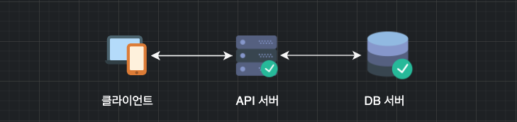
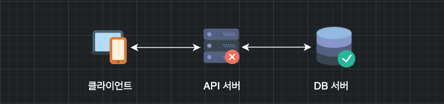
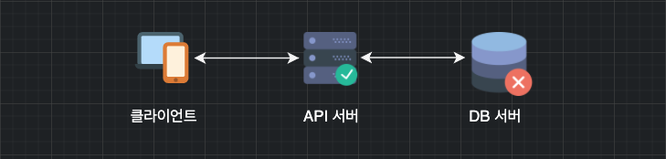
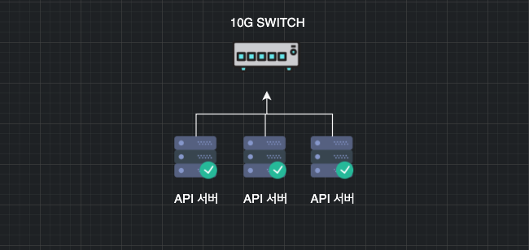
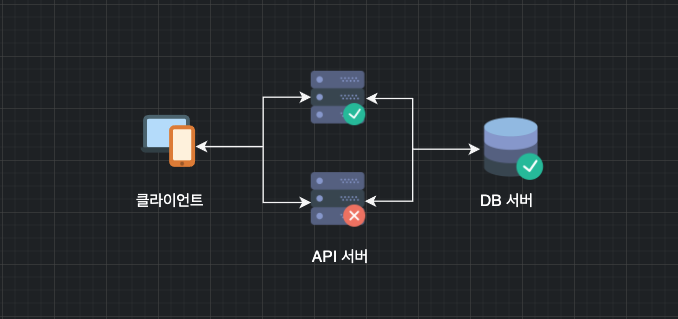
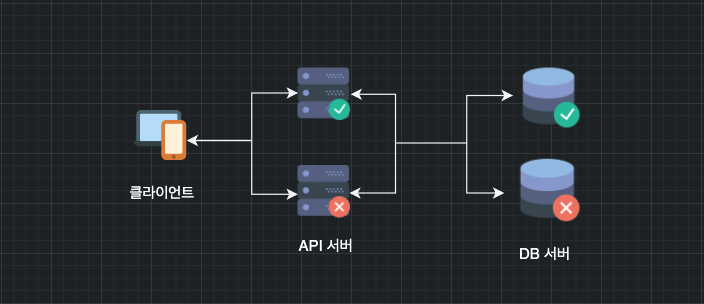

## 단일 장애 지점(Single Point Of Failure)이란?

- 시스템 구성 요소 중에서, 동작하지 않으면 전체 시스템이 중단되는 요소를 말한다.
- 이중화가 되어있지 않은 요소라면 SPOF일 가능성이 높다.
- 장애회복성을 위해서 SPOF가 없어야한다.

## SPOF의 예시

- 단일 서버

  - 하나의 API 서버에 하나의 DB 서버를 사용하고 있는 상황
    

### API 서버에 장애가 난다면?

- 다른 시스템 요소들과 관계 없이 전체 시스템이 먹통된다. 

### DB 서버에 장애가 난다면?

- 이 역시 SPOF이다.

### Network의 Bandwidth 한계

- 10G 스위치에 10Gbps 이상의 데이터가 전달된다면, Capacity를 넘어가는 순간부터 패킷 드랍이 발생한다.
- Switch도 이중화가 필요하다.

### 서버에 연결된 인터넷 망이 장애가 난다면?

- 단일 인터넷망을 사용하면 이 또한 SPOF이다.

### 이 외에도 많은 단일화 되어있는 요소들이 SPOF이다.

## SPOF방지

- API서버를 늘려보자

- API 서버 한 대에 에러가 나도 서비스가 가능하다.
- 하지만 여전히 DB서버는 SPOF이다.
- DB서버 또한 이중화를 한다.

- 이 외에도 Switch, Route 등의 서버 외의 하드웨어 부분에 SPOF가 발생할 수 있다.

- 이러한 SPOF의 방지와 서비스의 복원력에는 당연하게도 큰 비용이 뒤따른다.
  - 서버 및 스토리지의 이중화

## References

- 위키피디아 - https://ko.wikipedia.org/wiki/%EB%8B%A8%EC%9D%BC_%EC%9E%A5%EC%95%A0%EC%A0%90

- https://blog.gigamon.com/2018/08/31/understanding-single-points-of-failure/

- https://searchdatacenter.techtarget.com/definition/Single-point-of-failure-SPOF

  
