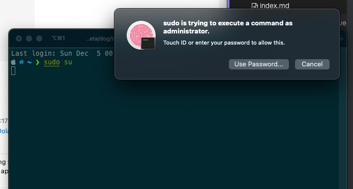
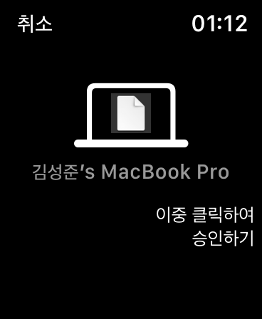

> - 요즘 애플워치로 맥 비밀번호( Touch ID )를 대신 하는 재미가 있다.
> - 1password 비밀번호가 상당히 긴데 다 안 치고 애플워치( Touch ID )로 쓰니 쾌감
> - 터미널에서도 sudo를 사용할 때 비밀번호를 touch id로 하는 법은 없을까 하다 검색해봤다.

**선 1줄요약**

```sh
curl -sL https://gist.githubusercontent.com/RichardBronosky/31660eb4b0f0ba5e673b9bc3c9148a70/raw/touchid_sudo.sh | bash
```

## Mac에서 Touch ID로 암호 대신 sudo 인증하기

- 원래는 `sudo [command]` 같이 sudo 권한을 사용하려고 하면 비밀번호로 인증을 해야한다.


- 먼저 `/etc/pam.d/sudo` 파일을 수정해야하는데 읽기만 가능한 파일이라 변경해야한다.

```sh
sudo su
cd /etc/pam.d
chmod 755 sudo
# or chmod u+w /etc/pam.d/sudo
```

- `sudo` 파일의 맨 윗 줄에 `auth sufficient pam_tid.so ` 을 추가한다.

```sh
vi sudo
```

```
# sudo file
auth       sufficient     pam_tid.so #  <<<< 이 부분을 추가합니다.
auth       sufficient     pam_smartcard.so
auth       required       pam_opendirectory.so
account    required       pam_permit.so
password   required       pam_deny.so
session    required       pam_permit.so
```

- 다시 읽기만 가능한 권한으로 변경해줍니다.

```sh
chmod 444 sudo
# or chmod u-w sudo
```

끝!





* 애플워치에서도 잘 보입니다


## Reference

* https://apple.stackexchange.com/questions/259093/can-touch-id-for-the-mac-touch-bar-authenticate-sudo-users-and-admin-privileges/306324#306324
